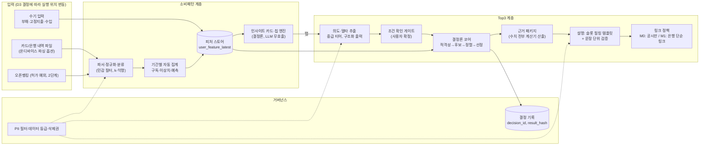

# DONN 기획 부록 v0.1, 소비패턴 분석·Top3 추천·후속질의·첫 화면 UX

> **변경 공지 (2026-09-06, PMO 결정)**: PoC(데모)는 **Google Gemini API** 사용(키 PMO 제공), **오픈뱅킹은 PoC에서 제외**, 실사용자 데이터 없이 합성 데이터·수기 입력·브라우저 내 파일 파싱으로 시연. 상세 범위와 결정 변경 로그는 `docs/DONN_POC_SCOPE.md` 참조. 6.7절(LLM 모델 선택)은 공급자 중립으로 개정됨.

| 항목 | 내용 |
|---|---|
| 문서 | DONN_ADDENDUM_v0.1 (본 기획안 `DONN_PLAN_v0.1.md`에 병합 예정) |
| 작성일 | 2026-09-05 |
| 작성 역할 | 수석 편집자 겸 아키텍트 |
| 입력 | 설계서 3종(spending / reco / ux), 검증 4종(data / privacy / regulatory / engineering), UX 심사 3인(user / growth / compliance) |
| 전제 | 팀 2~4명, MVP 3~4개월, 한국 시장, LLM은 Anthropic Claude API(플래그십/중급/경량 티어로만 표기, 모델 ID·가격 미기재) |
| 표기 규칙 | **(확인 필요)** = 근거 미확정 항목. **[본안 반영 시 조정 필요]** = 본 기획안과 충돌 가능 지점. 검증 ID(D-xx, P-xx, R-xx, E-xx, U-xx) = 9장 검증 로그 참조 |
| 수정 원칙 | 검증에서 severity 3 이상으로 지적된 항목은 설계를 수정해 반영하고, 각 장 끝 '검증 반영' 소절에 남김. severity 2 항목도 비용이 작으면 반영 |

> 바쁘면 **0장(답), 1.4(규제 등급 변화), 7장(결정 사항)** 만 읽어도 된다.

---

## 0. PMO 질문에 대한 답

### 0.1 질문
> "첫 질의를 메인 채팅 화면 + 추천 질의로 가야 할까?"

### 0.2 답 (권고안)

**예. 단, "빈 채팅창 + 정적 추천 질의"가 아니라 "데이터에서 계산된 인사이트 카드 + 데이터에서 파생된 추천 질의 칩 + 상시 입력창"의 하이브리드(UX 설계서의 C안)로 가야 하며, '사용자 개시(User-initiated)' 원칙 위에 얹어야 한다.**

UX 심사 3인 모두 C안을 선택했다(사용자 관점 8점, 성장 관점 8점, 컴플라이언스 관점 7점 / 10점 만점). A안(순수 채팅)은 4·5·5점, B안(대시보드 우선)은 5·4·6점.

권고안의 7가지 조건:

| # | 조건 | 왜 필요한가 | 출처 |
|---|---|---|---|
| 1 | **첫 질의는 '탭 1회'**, 카드의 질문 버튼 또는 칩을 누르는 것이 곧 첫 질의. 빈 입력창은 항상 보이되 주인공이 아님 | 부채는 사용자가 '무엇을 물어야 할지 모르는' 영역(백지 문제). 40~50대·다중채무 페르소나는 빈 입력창 앞에서 멈춤 | user, growth |
| 2 | **카드는 사실만**: 관찰 + 근거 데이터 + 질문 버튼. 상품명·금융회사명·행동 지시 금지 | 첫 화면에 상품이 없어야 금소법상 광고·권유 노출을 피하고, 프로파일링 산출물의 설명 가능성을 확보 | compliance |
| 3 | **사용자 개시 원칙**: 시스템(카드·푸시·알림)이 먼저 Top3를 띄우지 않음. 반드시 (a) 사용자의 탭/발화 → (b) 조건 확인·수정 화면 → (c) 결과 순서 | "플랫폼이 잠재고객을 발굴해 가입을 유도한다"는 금융당국의 중개 판단 기준(2021-09)에 대한 핵심 방어선 | compliance, regulatory 검증 |
| 4 | **텍스트/카드 분리 하드 게이트**: LLM 본문·칩·인사이트 카드에 상품명·회사명·시장 금리 수치가 검출되면 렌더링 자체 차단 | 자유 발화가 '권유'로 흐르는 것을 구조적으로 차단 | compliance, ux |
| 5 | **콜드스타트 별도 화면 없음**: 데이터가 없으면 C안이 자동으로 '가정을 명시한 미리 보기 카드 + 부채 유형별 정적 칩 + 데모 모드'로 축퇴. 대시보드는 첫 화면이 아니라 두 번째 화면('내 부채 전체') | 첫 진입 사용자는 부채 0~2건뿐. 빈 대시보드(B안)는 최대 이탈 지점 | ux, growth |
| 6 | **톤·취약 사용자·데이터 충분성 게이트**: 부정 카드만 반복 노출 금지(중립·긍정 카드 최소 1장), 낙인·공포 문구 금지, 최소 관측 기간 미달 시 카드 미생성, 위기 사용자는 상품 대신 공적 상담 안내 우선 | 첫 화면 카드가 틀리거나 불안을 자극하면 C안의 손실이 A안보다 큼 | user, compliance |
| 7 | **계측 동시 출시**: 첫 질의 도달률(첫 진입/재방문 분리), 칩 클릭률, 후속 질의율 등 퍼널 이벤트를 1개월차 릴리스에 포함 | 첫 4주 베이스라인 없이는 어떤 안도 평가 불가 | growth |

### 0.3 이유 (3인 공통 논거)

1. **PMO 추가 요구사항과 구조가 동형**이다. "기간별 자동 분석 → Top3 + 이유 + 바로가기 → 후속 질의로 변수 적용 재실행"은 그 자체가 "분석 결과가 먼저 말을 걸고, 대화로 조건을 바꾼다"는 C안의 흐름이다.
2. **첫 질의 도달과 재방문 트리거를 동시에 해결**하는 유일한 안이다. A안은 재방문 이유가 없고, B안은 핵심 가치(행동 추천)가 두 번째 탭 뒤에 숨는다.
3. **규제 경계 관리가 UI 구조로 강제**된다. 첫 화면 상품 무노출(B안과 동일) + 상품은 사용자 조건 아래 구조화 카드로만 + '왜 나왔나요?' 링크(개인정보보호법 제37조의2 대응).
4. **구현 범위가 팀 규모에 맞는다**. A안 + 규칙 엔진(트리거 6~8개, 야간 배치) + 카드 컴포넌트 수준이며 B안 전체보다 작다.
5. 데이터 파생 칩(Tier 1)을 A안에 넣는 순간 사실상 C안으로 수렴하므로, A안을 독립 대안으로 유지할 이유가 없다.

### 0.4 반대·우려 의견 요약과 처리

| 우려 | 제기자 | 본 문서의 처리 |
|---|---|---|
| "데이터가 먼저 말을 건다" 구조는 금융당국이 2021-09에 밝힌 '추천 = 잠재고객 발굴·가입 유도(중개)' 판단 기준에 가장 가까운 형태. 퍼널 KPI(바로가기 클릭률 등) 자체가 '판매 목적' 정황이 될 수 있음 | compliance | 사용자 개시 원칙(0.2-3)을 하드 게이트로 채택. 카드·칩은 상품 유형도 지목하지 않는 중립 문구로 고정. **등록·지정 전에는 Top3를 '실명 상품 추천'이 아니라 '내 조건으로 정렬한 공시 열람(익명/공시 표기, 금감원 공시 링크만)'으로 축소**(3.2절 M0 모드). 내부 명칭·지표명도 '추천/전환' 대신 '비교/공시 열람 이동'으로 관리 |
| 카드 우선순위가 '시급성×금액 영향'이면 첫 화면이 늘 나쁜 소식으로 시작해 불안 사용자가 앱을 회피(B안의 낙인 문제가 C안으로 이전) | user | 카드 균형 규칙 신설: 중립·긍정 카드 최소 1장, 같은 부정 규칙 14일 쿨다운, 소득 대비 비율 같은 수치심 유발 숫자는 맥락 없이 단독 노출 금지(2.9절) |
| 데이터 빈곤: 마이데이터 미허가 상태에서 소비 카드 입력이 수동 업로드에 의존하므로 재방문 사용자 대부분이 'A 상태'에 머물러 C안의 우위가 실측되지 않을 수 있음 | growth | 첫 릴리스 카드는 부채 데이터만으로 만들 수 있는 것(재산정일, 남은 총이자, 상환 부담률)에 한정하고 소비 카드는 3개월차로. 잠금 카드("부채 1건 더 등록하면 열려요")로 데이터 축적 루프 명시(4.2절) |
| LLM 추정 조건이 틀려도 저지식 사용자는 알아차리지 못한 채 Top3를 믿음. 잘못된 조건 + 바로가기는 실질적 해 | user | 첫 결과 노출 전 조건 확인·수정 단계를 **강제**(추정 배지, 확정 버튼). 대출성 상품은 필수 슬롯 확인 게이트(3.4절 (a')) |
| 면책 고지·관점 라벨이 전문가 언어. '이자 최소'는 사실상 1위로 읽힘 | user, compliance | 쉬운 말 병기 원칙(4.8절). 관점은 '단일 기준 정렬'로 재정의하고 정렬 기준을 화면에 문장으로 표시(3.6절) |
| 추천 질의 칩은 정적 문구가 아니라 피처 스토어에서 생성해야 의미가 있음(조건부 찬성) | spending 설계서 | 칩 생성 규칙을 Tier 0/1로 확정, Tier 2(LLM 생성)는 등록 후·후순위(4.3절) |

### 0.5 답의 전제: 칩이 이끄는 '결과'의 형태는 규제 트랙 결정에 종속된다

첫 화면 UX의 답과 별개로, 규제 검증(R-01, R-02, R-03)은 **"실명 상품 Top3 + 추천 이유 + 판매업자 바로가기"를 등록·지정 없이 출시하는 것은 금소법상 무등록 중개·광고로 판단될 소지가 크다**고 지적했다. 따라서 본 문서는 Top3 파이프라인을 두 모드로 나눈다(3.2절). PMO는 7장 D1·D2·D5에서 트랙을 결정해야 하며, **결정 전까지 MVP는 M0(등록 전) 모드로 설계·개발한다.**

---

## 1. 추가 요구사항이 전체 아키텍처에 미치는 영향

### 1.1 요구사항별 변경 요약

| PMO 추가 요구사항 | 기존 구조에서 없던 것 | 새로 생기는 것 | 영향 크기 |
|---|---|---|---|
| 사용자 소비패턴 분석 | 거래 데이터 자체(기존은 회원가입 시 수집한 정보 + 상품 RAG뿐) | 거래 데이터 확보 경로, 파서, 가맹점 정규화·분류, 개인 사전 | **대**, 데이터 확보 경로가 인허가 문제와 직결(D-01, D-02) |
| 기간별 소비패턴 분석(자동) | 배치·트리거 인프라, 피처 스토어 | 일/주/월 집계 잡, 구독·이상치 탐지, 현금흐름 구간 예측, 인사이트 카드 엔진 | 중, 단, '자동 분석'은 프로파일링이므로 별도 선택 동의·설명·거부 경로 필요 |
| 상품 추천 Top3 + 이유 + 바로가기 | 결정론적 순위 코어, 근거 패키지, 설명 검증기, 링크 정책 | 상품 스냅샷 적재기(공시 소스), 규칙 레지스트리, 금융 계산기, 정렬·선정, 슬롯 필링 설명, 링크 큐레이션, 감사 로그 | **대**, 규제 등급을 '정보 제공'에서 '중개/자문 후보'로 끌어올림(R-01) |
| 후속 질의 시 변수 적용 재실행 | 대화 상태(컨텍스트 버전), 시나리오 계산기 | 델타 추출 → 컨텍스트 병합 → 결정론 구간 재실행, 조건 바텀시트, diff 템플릿 | 중, 원본 재분류가 아니라 시나리오 계층 재계산으로 밀리초 처리 |
| 첫 질의 = 메인 채팅 + 추천 질의 | 인사이트 카드·칩 생성 규칙 | 카드 규칙 엔진(배치), Tier 0/1 칩 템플릿, 조건 확인 단계 | 소~중 |

### 1.2 데이터 흐름 변경(요약)



기존 구조(RAG 상품 + 사용자 정보 DB → 자연어 QA LLM → 답변)와의 결정적 차이:
- **LLM이 답을 만드는 구조 → 코드가 답을 만들고 LLM은 문장만 쓰는 구조.** 순위·수치·상품 선택은 100% 결정론 코드, LLM은 (a) 발화→변수 추출, (f) 플레이스홀더 문장 생성 두 곳만.
- **개인신용정보 파생값은 외부 LLM으로 나가지 않는다**(5.2절 데이터 등급표). 설명 문장은 값이 비어 있는 슬롯을 코드가 채운다.
- **첫 화면 로드에 LLM 호출 0회.** 카드·칩은 배치로 사전 계산.

### 1.3 새 컴포넌트 목록

| 컴포넌트 | 책임 | MVP | 비고 |
|---|---|---|---|
| Upload/Parser (또는 온디바이스 파서) | 매직바이트 스니핑, 포맷 식별, 정규 스키마 매핑, 검증 | O | 실행 위치는 D3 결정 |
| Merchant Normalizer + 민감 가맹점 필터 | 가맹점 정규화, 민감정보 축약, k-익명 카운트 | O | |
| Classifier (개인 사전 → 전역 사전/룰 → 경량 티어 배치 → 사용자 확인) | 카테고리 L1/L2 | O | 임베딩 kNN은 Post-MVP |
| Scheduler + Analytics Jobs | 일/주/월 집계, 구독·이상치, 구간 예측 | O | 예측은 룰 기반 |
| Feature Store | 기간별 피처·최신 스냅샷·버전 | O | |
| Insight/Chip Engine | 카드 규칙·억제·균형·칩 생성 | O | 결정론, LLM 무호출 |
| Scenario Calculator | 후속 질의 변수 적용(밀리초) | O | 순수 함수 |
| Product Snapshot Loader + Curation DB | 공시 적재(변경 시 발행), 기관 10~15개 우대조건·링크 수작업 큐레이션 | O | **상시 인력 소요**(E-18) |
| Rules Registry | 적격성·규제 파라미터(시행일 포함), 정렬 규칙 버전 | O | |
| Financial Calculator | 상환 스케줄·총이자·DSR·수수료, 정수/고정소수 명세 | O | 골든 벡터 테스트 |
| Ranking Core | 적격성 → 후보 → 정렬 → 선정 → 근거 패키지 | O | `rank(context, snapshot_id, rules_version, engine_version)` |
| Explanation Service | 슬롯 필링 문장 생성 + 문장 단위 검증 + 템플릿 폴백 | O | 중급 티어 |
| Link Resolver | 모드별 링크 정책, 인터스티셜, 큐레이션 링크 검증 | O | |
| Decision Log + Replay | decision_id, fingerprint, result_hash, 버전 전부 | O | 보관 10년 전제(R-07) |
| Privacy Layer | PII 필터, 데이터 등급 게이트, 사용자별 DEK, 접속기록/내용 로그 분리, 삭제 잡 | O | |
| Synthetic Data Generator | 페르소나 합성 거래·정답 라벨·포맷 렌더링(HTML-as-xls 포함) | O | 골드셋은 합성만(P-12) |
| Open Banking Connector | 이용기관 등록, 증분 조회, 3개월 창 백필, 토큰 갱신 | 2단계 | 신청은 Phase 0 착수(D-09) |

### 1.4 규제 등급 변화

| 축 | 기존 구조(QA + 상품 RAG) | 추가 요구사항 반영 후 | 근거 |
|---|---|---|---|
| 금소법 판매 규제 | 일반 정보 제공(낮음) | **개인화 Top3 + 바로가기 = 권유·중개 판단 가능성 높음**. 구독 유료화 시 자문업. 등록 전 광고 금지(제22조) | R-01, R-04, R-05 |
| 신용정보법 | 회원 정보 처리 | **카드+은행 내역을 서버에 저장·통합·가공하면 무허가 본인신용정보관리업 판단 위험**(허가 예외는 '인터페이스만 제공'·오픈뱅킹 정보) | D-01, D-02 |
| 개인정보보호법 | 일반 동의 | 민감정보(의료·종교·정치·노조 가맹점) 별도 동의, 국외 이전(외부 LLM) 근거·처리방침, 자동화된 결정(제37조의2) 설명·거부 경로, 접속기록 2년 | P-02, P-04, R-11 |
| AI 관련 | 생성형 AI 고지 | AI 기본법(2026-01-22 시행) 생성물 표시·사전 고지, 금융분야 AI 가이드라인(2026-06-22 시행) **적용 대상**(금융거래에 영향 주는 핀테크 포함), 고영향 AI 자체 평가 | D-11, R-08 |
| 광고성 정보 | 없음 | 푸시·알림에 상품 언급 시 정보통신망법 광고성 정보 동의 **(확인 필요)** | compliance 심사 |

요약: 추가 요구사항은 DONN을 "낮은 규제의 정보 서비스"에서 **"등록 또는 샌드박스 없이는 핵심 기능을 출시할 수 없는 서비스"** 로 바꾼다. 이것이 본 부록에서 가장 큰 아키텍처 결정이며, 7장 D1~D5로 연결된다.

### 1.5 본 기획안과 충돌 가능 지점 **[본안 반영 시 조정 필요]**

1. 본안의 "RAG/API로 은행 금융상품 적재": 금감원 '금융상품한눈에' 오픈API는 월 단위 공시이고, 개인신용대출은 상품별 금리가 아니라 신용점수 구간별 전월 평균금리다(R-03, E-01). 본안의 상품 DB 정의를 '소스별 의미 태그(offer_rate / disclosed_avg_rate / curated)'로 재정의해야 한다.
2. 본안의 "자산 생애주기 예측 모델": MVP에서는 룰 기반 '다음 달 잔여 여력 구간 예측'(2.6절)으로 축소하고, 생애주기 모델은 Post-MVP로. 두 모델의 입력·출력 관계를 본안에서 정의해야 한다.
3. 본안의 "회원가입 시 동의받아 수집한 사용자 정보 DB": 동의 항목을 6개로 재설계(4.7절, 5.3절), 필수 2 + 선택 4(소비패턴 자동 분석, 업로드 내용 분석, 민감정보, 마케팅) + 국외 이전 처리방침 고지.
4. 본안의 "페르소나별 답변 평가": 페르소나마다 합성 거래내역을 붙이고(2.11절), 평가 축에 '피처 인용 정확성·행동 논리 일관성·규제 문구'를 추가하며, **규제 준수 축은 LLM 평가자가 아니라 사람(컴플라이언스) 검수**를 릴리스 게이트로 둔다.
5. 본안의 "자연어 질의 응답 LLM": 자유 질의 답변도 "시뮬레이션 결과 + 고려 요소"에 머물고 특정 행동을 결론으로 제시하지 않는 답변 템플릿을 적용해야 한다(자문 경계, compliance 심사).
6. 본안 로드맵(3~4개월): Phase 0 '규제 게이트'(2~3주)가 추가되고 기능 범위가 축소된다(6장).

### 1.6 검증 반영
- R-01/R-02/R-03/E-01 → 1.4절 규제 등급 변화, 1.5절 1번, 3.2절 2모드 설계.
- D-01/D-02 → 1.4절, 2.2절 데이터 경로 옵션, 7장 D3.
- D-11 → 금융분야 AI 가이드라인을 '자발적 채택'이 아니라 '적용 대상'으로 정정(1.4절, 5.1절).
- E-18 → 1.3절 컴포넌트 표에 큐레이션 상시 인력 표기, 6.3절 인력 배치.

---

## 2. 소비패턴 분석 파이프라인

### 2.1 목적과 세 가지 산출

소비패턴 분석은 독립 기능이 아니라 부채 행동 추천의 **분모(여력)** 를 만드는 엔진이다.

| 산출 | 정의 | 행동 추천 연결 | Top3 연결 |
|---|---|---|---|
| 상환 여력 | 수입 − (고정지출 + 변동필수지출 + 기존 부채 상환액) − 완충금 | "월 N만 원 추가 상환 시 이자·기간" 시뮬레이션 입력 | 대환 후보 조건, 월 납입 가능액 상한 |
| 재량 소비 여지 | 재량 카테고리 월 지출과 변동성 | 절감 시나리오(10/20/30%) | 절감분을 담을 상품 유형(**M1 모드에서만 상품 연결**) |
| 절약 가능 항목 | 반복 결제(구독), 급증 카테고리 | "구독 정리 시 월 X원 → 추가 상환" | 절감액 규모별 후보 |

피처 → 행동 매핑 원칙(원 설계서 1.3절)은 유지하되, 한 줄을 추가한다: **여력 ≤ 0 이거나 위기 신호(연체 징후·리볼빙·상환 부담률 임계 초과, 기준값 확인 필요)가 감지되면 상품 연결을 억제하고 공적 채무조정·상담 안내를 우선한다**(U-08).

### 2.2 거래 데이터 확보 경로 (수정판)

검증 결과 원 설계의 핵심 가정 두 개가 규제 근거와 충돌한다.
- **파일 업로드 = "별도 인허가 없음"은 미검증 가정이다(D-01).** 금융위 Q&A(2020)는 카드정보만 수집한 통합조회도 허가 대상이라 하고, 예외는 '금융회사로부터 제공받지 않는 경우'와 '개인신용정보를 저장·접근하지 못하는 단순 가계부 앱'뿐이며, 신용정보업감독규정과 2023-06-29 법령해석은 '사업자가 접근·조회·관리 권한이 없는 인터페이스만 제공'하는 경우만 예외로 본다. 서버 저장·운영자 조회·파생 피처를 갖는 원 설계는 이 예외를 충족하지 않는다. 위반 시 신용정보법 제50조 제2항 형사처벌 대상.
- **마이데이터 사업자 '제휴' 경로는 이미 불가로 해석된 구조다(D-02).** 무허가 회사는 접속 중개만 가능하고 통합정보의 추가 가공이 금지된다. → 원 설계의 3단계 '제휴' 옵션을 삭제하고 3단계 = 직접 허가로 단일화. 대안으로 '역방향 임베딩'(DONN 분석 모듈을 마이데이터 사업자 시스템 안에서 위탁 실행, 데이터가 DONN으로 나오지 않는 구조)만 법무 검토 항목으로 남긴다.

**수정된 비교표**

| 경로 | 카드 개별 승인내역 | 신선도 | 인허가 | 사용자 마찰 | MVP 판단 |
|---|---|---|---|---|---|
| ① 파일 업로드(카드·은행) | 포함 | 수동 | **서버 저장·통합 시 무허가 마이데이터 판단 위험 (확인 필요, Phase 0 차단 항목)** | **높음**(카드사별 PC 전용 다운로드·조회기간 분할·암호 파일, D-05) | 조건부, 아래 옵션 P-A/P-C 형태로만 |
| ② 오픈뱅킹(금융결제원) | 계좌 거래는 미포함. 카드 청구 API 4종(목록·기본·청구기본·청구상세)이 있으나 **청구(매입) 기준이며 핀테크 이용기관 개방 여부·허가 예외 유지 여부 (확인 필요)**(D-03) | 자동 | **허가 예외 정보(계좌잔액·거래내역 등)로 명시**, 은행 데이터의 가장 안전한 경로 | 낮음(계좌 등록 1회, 인증 페이지 경유) | **앞당김**, 이용기관 신청·보안점검을 Phase 0에 착수(리드타임 1~2개월 + 보안점검, D-09) |
| ③ 마이데이터 직접 허가 | 포함 | 정기 주 1회 + 비정기(사용자 요청 시) | 자본금 5억, 물적·보안·인력·보험 요건, 예비허가 경유, 법정 심사 3개월(보완 시 연장) | 낮음 | Post-MVP 사업 결정 |
| ④ 수기 입력 | 해당 없음 | 사용자 갱신 시 | 없음 | 높음 | **필수**, 부채·고정지출·월 수입 |

**데이터 경로 아키텍처 옵션(7장 D3)**

| 옵션 | 구조 | 장점 | 단점 |
|---|---|---|---|
| **P-A 온디바이스** | 파싱·정규화·룰 분류·개인 사전·집계를 단말(앱/Web 브라우저)에서 수행. 서버는 2.7절 피처 값과 사용자 확인 라벨만 수신. 신규 가맹점 문자열은 단말이 HMAC 해시만 서버로 보내 k-익명 카운트를 확인한 뒤(k≥5) 원문을 전송 | 원문 거래가 서버에 없어 '저장·접근 없음' 예외 요건에 가장 가까움 **(예외 해당 여부는 법령해석 확인 필요)**, 삭제권·국외이전 부담 급감 | 단말 파서 구현 난이도, 다기기 동기화, '자동' 기간 분석이 앱 실행 시에만 수행됨(푸시 없는 야간 배치 불가) |
| **P-B 오픈뱅킹 우선** | 은행 데이터는 오픈뱅킹으로 서버 수집(허가 예외 확인 후). 카드는 청구 API 개방 시 그 경로, 아니면 P-A 또는 P-C | 은행 데이터 자동 갱신, 수입·상환·잔액 피처 활성화 | 카드 승인내역 없이 카테고리 분석 약함, 조회 수수료·조회기간 3개월 창·토큰 만료 관리 필요 |
| **P-C 수기·요약만** | 부채·고정지출·월 카테고리 합계를 사용자가 입력. 파일 업로드는 단말에서 '요약 계산 후 폐기' | 인허가 리스크 최소 | 정확도 낮음, 구독·이상치 탐지 불가 |

**추천**: Phase 0에서 금융위 법령해석·비조치의견서 요청을 차단 항목으로 올리고, 회신 전에는 **P-A + P-B 조합**으로 설계를 진행한다(서버는 피처만, 은행은 오픈뱅킹). 회신이 서버 저장을 허용하면 파서를 서버로 옮기는 것은 쉽지만 반대는 어렵다.

### 2.3 수집·파싱 규칙 (수정 사항 중심)

| 항목 | 수정된 규칙 | 근거 |
|---|---|---|
| 0단계 매직바이트 스니핑 | OLE2 → xls 파서, ZIP → xlsx 파서, `<html`/`<table` → HTML 테이블 파서(인코딩 탐지), 그 외 → 구분자 탐지 CSV/TSV. 국내 '엑셀 다운로드' 다수가 HTML-as-xls·TSV-as-xls | D-06 |
| 파일 종류 분리 | `source_type` = `CARD_FILE_APPROVAL`(승인, 실시간, 취소 행 포함) / `CARD_FILE_BILLING`(청구·이용, 매입 후, 정정 금액·할부 회차) / `BANK_FILE` / `OPENBANKING` / `OPENBANKING_CARD_BILL`(개방 확인 시) / `MANUAL`. 동일 카드·동일 기간에 승인·청구가 모두 있으면 승인 우선 채택, 할부 규칙은 승인 파일에서만 적용 | D-07 |
| 상태값 | 마이데이터 카드 규격의 `status`(01 승인/02 승인취소/03 정정/04 무승인매입)와 `pay_type`(01 신용/02 체크)을 정규 스키마에 **필수**로 채택 | D-04, D-07, D-08 |
| 중복 제거 키 | 승인번호가 있으면 **HMAC(승인번호, KMS 키)** 토큰만 저장해 dedup 키로 사용(원값 폐기 → 최소수집 유지). 없으면 (날짜, 금액, description_masked, 파일 내 동일 조합 출현 순번) | D-07 |
| PDF 명세서 | 이메일 명세서(암호 PDF) 파싱을 후순위가 아닌 **MVP 범위로 격상**. 암호 해제는 단말에서, 서버는 비밀번호를 받지 않음 | D-05 |
| 카드사별 다운로드 가이드 | 경로·조회기간 제한·암호 여부를 Phase 0 산출물로 작성. 6개월 단위 분할 업로드가 dedup으로 안전히 합쳐지는지 테스트 | D-05 |
| 업로드 퍼널 지표 | 안내 진입 → 파일 확보 → 파싱 성공 → 분류 완료 비율을 추적. "대부분 사용자는 업로드 즉시 콜드스타트를 벗어난다"는 문구는 근거 확보 전까지 (확인 필요) | D-05 |
| 컬럼 매핑 LLM 폴백 | 헤더 후보 행에 PII 정규식(계좌번호 패턴, 카드번호 Luhn, 주민번호, 전화번호, 6자리 이상 연속 숫자) 적용 → 매칭 시 전송 차단, 수동 매핑 UI 폴백. 샘플 값 대신 **컬럼별 타입 통계**(dtype, null 비율, 날짜 포맷 패턴, 부호 분포)만 전송. 헤더 위 행은 코드 레벨 어설션으로 전송 금지 | P-11 |
| 파서 격리 | 파일 크기·행 수·압축 해제 비율 상한, 네트워크 차단 워커에서 values-only 파싱(수식·매크로·외부 링크 무시), XML 외부 엔티티 비활성화. 파싱 실패 파일은 격리 버킷, 자동 재시도 금지 | P-15 |
| 원본 파일 | 파싱 성공 확인 후 즉시 삭제. 실패 디버깅 보관은 동의 하 최대 7일 | 원안 유지 |

### 2.4 정규 스키마 변경 필드

```text
transaction (P-A 옵션에서는 단말 로컬 저장, 서버 미보관)
- source_type (2.3절 확장), status, pay_type
- approved_num_hmac (nullable)          ← 승인번호 원값 대신
- counterparty_ref_masked                ← 상대 계좌 '은행코드+뒤 4자리' 또는 HMAC (P-06)
- description_masked                     ← 인명 토큰 마스킹본. description_raw는 정규화 완료 후 파기 (P-14)
- merchant_norm, branch, payment_channel
- is_sensitive_merchant (bool)           ← 민감 가맹점 필터 결과, true면 merchant_norm 미저장·상위 범주만 (P-04)
- category_l1, category_l2, category_source, confidence
- dedup_hash (description_masked 기준), installment_months, is_cancelled, is_foreign
```

마이데이터 3단계 대비 필드는 규격 기준으로 정정: `approved_num, approved_dtime, status, pay_type, merchant_name(선택전송), merchant_regno(선택전송), approved_amt, modified_amt, total_install_cnt`. **업종코드 필드는 규격에 없으므로 삭제**(D-08). 업종 신호는 카드사 엑셀의 업종 컬럼(있을 때만)과 사업자등록번호 기반 조회(가능 여부·법무 확인 필요)로 대체.

### 2.5 분류 체계

**택소노미**(원안 유지): L1 = `FIXED_ESSENTIAL / FIXED_DISCRETIONARY / VARIABLE_ESSENTIAL / VARIABLE_DISCRETIONARY / DEBT_SERVICE / SAVINGS_INVEST / TRANSFER_INTERNAL / INCOME / CASH_ATM / REFUND_CANCEL / UNCLASSIFIED`, L2 약 25개(초기 목록, 튜닝 대상). 사용자는 L1을 재정의할 수 있고(육아 가정의 배달=필수) 재정의는 개인 사전 전용.

**제외·특수 규칙 수정**

| 규칙 | 수정 내용 | 근거 |
|---|---|---|
| 본인 계좌 간 이체 | `counterparty_ref_masked`가 사용자 등록 계좌 참조와 일치하거나, 같은 날 동일 금액 IN/OUT 쌍이 서로 다른 소스에 존재 → `TRANSFER_INTERNAL` | P-06 |
| 신용카드 대금 결제 | 은행 적요가 카드사 결제 패턴 + 해당 카드 파일 존재 → `TRANSFER_INTERNAL` | 원안 |
| **체크카드** | `pay_type=02` 건은 은행 측 동일 날짜(±1일)·동일 금액·카드사/BC 접두어 적요 행을 `TRANSFER_INTERNAL`로 매칭. 카드 파일이 없으면 은행 행을 소비로 계상 | D-04 |
| **간편결제** | 충전은 `TRANSFER_INTERNAL`, 하위 결제는 카드 파일 쪽만 소비 계상. PG·간편결제 접두어는 `payment_channel`로 이동(접두어 목록은 실제 샘플로 구축, 확인 필요) | D-04 |
| 할부 | 승인 파일의 할부 총액은 월 분할액만 `installment_outstanding_monthly`에 반영 | 원안 |
| 부채 상환 식별 | 적요 패턴 + 사용자 등록 대출 상환일·금액 매칭(±3일, ±5%) + 월 주기 반복성 | 원안 |

**가맹점 정규화 + 민감 가맹점 필터(신설, P-04)**: 전각→반각·공백 정리 → PG 접두어 분리 → 지점 식별자 분리 → 온라인 마켓 하위 판매자 분리 → **민감 필터**(의료 세부 진료과, 종교, 정당·후원회, 노조, 성인 관련 키워드·업종코드) → 해당 시 `merchant_norm` 미저장, 상위 범주('의료', '기부·회비', '기타')로만 축약, LLM·전역 사전·임베딩·인사이트 문구에서 제외 → 전역 사전 조회 → 퍼지 매칭(임계 0.9) → 신규 큐. `merchant_norm` 길이 상한 40자, 허용 문자 집합 제한, 초과 시 `UNCLASSIFIED`(P-13).

**계단식 분류(수정)**

```text
거래 1건
  [0] 개인 사전 일치 → 확정
  [1] 전역 사전 / 정규식 룰 (카드 파일 업종 컬럼 있으면 최우선) → 확정
  [2] 경량 티어 LLM 배치 분류, 조건: 카드 파일 가맹점명만 / 민감 필터 통과 / k명(초기값 5) 이상 사용자에서 관측된 merchant_norm만
      (은행 적요는 LLM 전송 금지: 이체 상대 성명·아파트 동호수·회사명 등 단일 사용자 고유 문자열이 대부분, P-05)
  [3] 사용자 확인 후보 (저신뢰 < 0.6)
  Post-MVP: 임베딩 kNN(자체 호스팅 한국어 모델, 선정 확인 필요)
```

- LLM 입력은 데이터 블록으로 격리하고 `reason_short`는 UI·사전에 저장하지 않는다. **LLM 결과의 전역 사전 자동 등재 금지**: k명 이상 관측 + 운영자 승인으로만 등재(원안의 사용자 수정 승격 규칙과 동일 기준, P-13).
- 운영자 검토 화면에서도 k 미만 문자열은 마스킹(P-05).
- 한국어 인명 제거는 정규식 단독 의존 금지 → 자체 호스팅 NER + 금융 적요 토큰 화이트리스트(P-05).

**정확도 측정**: 골드셋은 **합성 데이터만**(2.11절)으로 구성하고 팀원 실데이터 라벨은 배제(P-12). 지표는 L2 매크로 F1, L1 정확도, 금액 가중 정확도, `DEBT_SERVICE`/`TRANSFER_INTERNAL` 정밀도·재현율, '동일 거래 1회 계상' 정합성(D-04), 민감 필터 재현율(P-04), 적대적 적요 케이스 통과율(P-13). 릴리스 게이트: 매크로 F1 하락 시 배포 차단.

### 2.6 기간별 자동 분석

| 요소 | 규칙 | 비고 |
|---|---|---|
| 집계 계층 | 일 / ISO 주 / **사용자 사이클 월**(급여일 추정 시작) / 분기 | 소비 포함 L1만 집계, `DEBT_SERVICE`·`SAVINGS_INVEST`·`INCOME` 별도, `TRANSFER_INTERNAL` 제외 |
| 전기 대비 변화 | MoM·3개월 이동평균·(13개월 이상) YoY. 절대 임계(초기값 3만 원)와 비율 임계(±30%)를 **동시에** 만족할 때만 '변화' | 분모 작을 때 과장 방지 |
| 계절성 | 12개월 미만은 한국 캘린더 이벤트 플래그(설·추석·연말·신학기)를 상수로 부여, 문맥 제공만 | 수치 예측 미사용 |
| 이상치 | 카테고리별 90일 중앙값·MAD robust z > 3.5(단건), 주 합계가 8주 중앙값 2배 + 절대 임계(카테고리 급증). **1회성 대형 지출(연납 보험료·가전·여행)은 '이벤트'로 분리하고 정상화 버전 병행 계산** | 카드 오탐 방지(growth 우려) |
| 반복 결제(구독) | 동일 `merchant_norm`, 금액 ±10%, 주기 27~33/6~8/360~370일, 3회 이상 확정. 신규(60일 내 첫 관측)·중단(예상일 +10일) 감지. '미사용' 여부는 데이터로 알 수 없으므로 '해지 검토 후보'라는 표현만 | 원안 |
| 현금흐름 예측 | 룰 기반 기대치(수입 중앙값 − 고정 − 부채 상환 − 변동필수 − 재량(정상화) − 완충금). 각 항의 3개월 최소~최대 합산으로 **구간** 제시. 잔액 데이터 있으면 일 단위 시뮬레이션으로 상환일 전 최저 잔액 | 시계열 모델은 Post-MVP **[본안 반영 시 조정 필요: 자산 생애주기 예측 모델과의 관계]** |
| 배치·트리거 | `ingest_parse`(업로드 즉시) → `classify_user_tx` → `recompute_affected`(영향 기간만) / `classify_new_merchants`(일 1회 배치) / `aggregate_daily·weekly·monthly` / `retention_cleanup`(일 1회) / `sync_openbanking`(2단계) | 모든 잡 멱등, `feature_version` |
| 온디바이스(P-A) 시 | 집계는 앱 실행 시 수행하고 결과 피처만 서버 동기화. '자동'의 의미가 '앱 진입 시 자동'으로 바뀜을 PMO에 명시 | D3 결정 종속 |
| 오픈뱅킹(P-B) 운영 규칙 | 사용자당 월 호출 상한, 앱 진입 갱신은 최근 조회 후 N시간 경과 시만, 백필은 3개월 창 단위 멱등 잡, 토큰 만료·갱신 실패 시 '재연결 필요' 상태 + 카드. 비용 추정식 = 사용자 × 계좌 × 페이지(25건) × 단가(단가·기간 상한·토큰 유효기간은 확인 필요) | D-09 |

### 2.7 MVP 피처(추천 엔진 입력)

원 설계서의 35개 중 MVP 1차 구현 15개(나머지는 Phase 3·Post-MVP):

| 피처 ID | 정의 | 갱신 |
|---|---|---|
| `income_monthly_est`, `income_regularity`, `income_cycle_day` | 월 수입 추정·정규성·급여일 | 월, 트리거 |
| `fixed_expense_monthly`, `variable_essential_monthly`, `discretionary_monthly(+normalized)` | 지출 구조 3개월 중앙값 | 주/월 |
| `debt_service_monthly`, `interest_paid_monthly_est`, `highest_apr_debt` | 부채 상환·이자·최고 금리 부채(사용자 등록 기준) | 월, 트리거 |
| `net_cash_flow_monthly`, `buffer_monthly`, `repayment_capacity_monthly` | 순현금흐름·완충금·추가 상환 여력 | 월, 트리거 |
| `subscription_count / subscription_monthly_total` | 활성 구독 | 주 |
| `projected_free_cash_next_month`(구간) | 다음 달 잔여 여력 | 월 |
| `data_coverage`, `classification_quality` | 커버리지·분류 품질(카드 생성 게이트 입력) | 트리거 |

`debt_service_ratio_est`는 규제상 DSR과 정의가 다름을 UI에 명시하고, **Top3 적격성의 hard 규칙에는 쓰지 않는다**(E-12: provenance가 사용자 입력/추정이면 conditional).

### 2.8 베이스 피처 vs 시나리오 피처 (후속 질의 재실행)

PMO 요구 "추가 질의 시 변수를 적용해 파이프라인을 다시 돌린다"는 **원본 재분류가 아니라 시나리오 계층 재계산**이다.
- 베이스 피처: 배치 산출, 질의로 바뀌지 않음.
- 시나리오 변수(칩 선택 또는 LLM 추출 후 **사용자 확정**): `discretionary_cut_pct, extra_repayment_amount, target_debt_id, cancel_subscriptions[], horizon_months, income_change_pct, sort_criterion(total_cost | monthly_payment | user_selected)`.
- 시나리오 계산기: 베이스 + 변수 → `repayment_capacity_scenario, interest_saved_est, months_saved_est, projected_free_cash_scenario`(밀리초) → 3장 결정론 코어 재실행 → 결과·diff 문장 재생성. **조건만 바뀐 재실행은 LLM을 호출하지 않는다**(설명은 템플릿 diff, growth 우려).
- 화면에는 "입력하신 조건 기준 추정" 표시.

### 2.9 인사이트 카드·칩 생성 규칙 (수정판)

| 규칙 ID | 조건 | 카드(사실 서술 톤) | 데이터 요건 |
|---|---|---|---|
| `IC01_new_subscription` | 신규 반복 결제 | "새 정기결제가 보여요: {merchant} 월 {amount}" | 카드 3개월+ |
| `IC02_category_spike` | 카테고리 MoM ≥ +30% & 절대 임계, **이벤트 제외** | "{category} 지출이 지난달보다 늘었어요. 어디서 늘었는지 같이 볼까요?" | 카드 3개월+ |
| `IC03_capacity_positive` | 여력 > 0 & 고금리 부채 | "이번 달 약 {amount} 추가 상환 여력이 보여요" | 부채 + 3개월 |
| `IC04_negative_cashflow` | 순현금흐름 < 0 2개월 연속 | "지출이 수입보다 많은 달이 이어졌어요" | 3개월+ |
| `IC05_repayment_risk` | 상환일 D-3 & 예측 최저 잔액 < 상환액 | "{date} 상환일 전 잔액을 확인해 보세요" | 잔액 데이터 |
| `IC06_interest_vs_discretionary` | 월 이자 ≥ 재량 소비의 50% | "이자로 나가는 돈이 재량 소비의 절반 수준이에요" | 부채 + 3개월 |
| `IC07_data_needed` | 커버리지 < 30일 | "카드 이용내역을 올리면 상환 여력을 계산해 드려요" |, |
| `IC08_low_confidence` | 미분류·저신뢰 > 30% | "거래 {n}건의 분류를 확인해 주세요" |, |
| **`IC09_debt_basic`(신설)** | 부채 1건 이상 | "남은 총이자 약 {interest}(가정 명시), 만기까지 {months}개월" / "다음 달 원금이 약 {amount} 줄어요" | 부채 1건, **첫 릴리스 카드** |
| **`IC10_rate_reset`(신설)** | 변동금리 & 재산정일 30일 이내 | "{date}에 금리 재산정이 예정돼 있어요" | 부채 1건 |
| **`IC11_data_quality`(신설)** | 사업/개인 지출 혼재 의심 | "사업 지출과 개인 지출이 섞여 있는 것 같아요. 5건만 구분해 볼까요?" | 사업자 |
| **`IC12_crisis`(신설, 최우선)** | 연체 징후·리볼빙/현금서비스 잔액·상환 부담률 임계 초과(기준값 확인 필요) | 공적 채무조정·상담 창구 안내 + "지금 당장 하지 않아도 되는 일" (기관·연락처 확인 후 기재). **상품 연결 억제** | 부채 |
| **`IC13_unlock`(신설)** | 다음 데이터로 열리는 카드 | "부채 1건 더 등록하면 '어떤 대출부터 갚을지' 카드가 열려요" |, |

**억제·균형·보호 규칙**
- 우선순위: `IC12 > IC05 > IC04 > IC03 > IC10 > IC09 > IC07 > IC08 > IC11 > IC02 > IC06 > IC01 > IC13`. 같은 규칙 14일 쿨다운, 하루 최대 2장(홈 카드 최대 3장).
- **균형 규칙(신설, U-03)**: 노출 카드 중 중립·긍정 카드(`IC09` 원금 감소, 만기 카운트다운 등) 최소 1장. 소득 대비 비율 같은 수치는 카드 본문에 단독 노출 금지(상세 화면에서 맥락과 함께).
- **데이터 충분성 게이트**: 커버리지 < 30일이면 `IC07·IC08·IC09·IC10·IC13`만. `IC08`이면 카테고리 카드 억제. 게이트 미달 시 정적 콘텐츠로 대체.
- 카드 문구는 템플릿 + 피처 값으로 결정적으로 생성. **LLM 톤 조정 사용 안 함**(R-04: 등록 전 LLM 다듬기 제거, 컴플라이언스 검수본만 배포).
- 금칙어: 비난·낙인·공포('과소비', '위험', '연체 위험!'), 권유형 어미('~하세요'), '추천', 최상급, 긴급 소구, 상품명·회사명·시장 금리 수치.
- 모든 카드에 '이 분석은 왜 나왔나요?'(사용된 데이터 항목·규칙) + '이 분석이 틀렸어요' + 분석 거부 + '사람에게 문의' 경로.
- 알림: 앱 내 카드 기본. 푸시는 별도 동의 시 `IC12·IC05·IC04·IC10`만, **본문은 중립 문구**("확인할 알림이 있어요")로 고정하고 상세는 앱 내에서만(P-16). 상품 언급 금지(정보통신망법 광고성 정보 해당 여부 확인 필요).

**추천 질의 칩**: 활성 카드 상위 2장의 질문 버튼 + 사용자의 최근 시나리오 변수 1개 + 기본 칩 1개. 생성 규칙은 4.3절.

### 2.10 개인정보 설계 요약 (상세는 5장)

- 최소수집: 필요 컬럼만 추출, 원본 파일 즉시 삭제, `description_raw`는 정규화 후 파기, 승인번호·상대 계좌는 HMAC/마스킹만.
- 동의 분리: 소비패턴 자동 분석(선택, 기본 OFF), 업로드 내용 분석(선택), 민감정보(선택, 별도), 국외 이전 처리방침 고지.
- 보관: 원문 거래·`description_masked` **13개월 롤링**, 가맹점명 제거된 월 집계 피처 24개월. 탈퇴·철회 시 5일 이내 삭제, 백업 30일 이내(P-07).
- 암호화: 사용자별 DEK(envelope) + KMS 마스터키. 삭제 시 DEK 파기(crypto-shredding)로 백업본 복호 불능(P-09).
- 로그: 접속기록(1~2년, 삭제권 이행 시 정보주체 식별자만 해시 치환)과 내용 로그(사용자 삭제와 함께 파기) 분리(P-08). LLM 로그는 해시·토큰 수·검증 결과만, 전문은 디버그 플래그 시 DEK 암호화 TTL 7일, 배치 `custom_id`는 무작위 UUID(P-10).
- 장기 미접속 자동 삭제(초기값 1년).

### 2.11 페르소나 합성 거래 생성기와 평가

- 페르소나 6종(사회초년생 신용대출·30대 전세대출·자영업 변동수입·다중채무 리볼빙·맞벌이 육아·데이터 부족 신규) + **체크카드·간편결제 비중 높은 페르소나 추가**(D-04) + 적대적 적요·민감 가맹점 케이스 주입(P-13, P-04).
- 시뮬레이터가 12개월 거래·정답 라벨 생성 → 실제 다운로드 포맷으로 렌더링(HTML-as-xls, TSV-as-xls, CP949 CSV, 암호 PDF 포함, D-06) → 파서·분류·구독·예측·인사이트·Top3까지 끝까지 실행.
- 평가 루브릭 추가 축: 피처 값 인용 정확성, 행동 논리 일관성(여력 ≤ 0 인데 저축 상품 금지 등), 규제 문구 준수(**사람 검수**). **[본안 반영 시 조정 필요: 페르소나별 답변 평가 절차]**

### 2.12 검증 반영

| ID | 지적 | 반영 |
|---|---|---|
| D-01 (5) | 파일 업로드 서버 저장·통합 = 무허가 마이데이터 위험 | 2.2절 경로 재평가, 옵션 P-A/B/C, Phase 0 차단 항목, 7장 D3 |
| D-02 (5) | 마이데이터 제휴 불가 | 2.2절 제휴 삭제, 직접 허가 단일화, 역방향 임베딩만 검토 항목 |
| D-03 (4) | 오픈뱅킹 카드 API 4종(청구 기준) 개방 여부 | 2.2절 `OPENBANKING_CARD_BILL` 조건부 추가, 5.6절 확인 항목 |
| D-04 (4) | 체크카드·간편결제 이중계상 | 2.5절 `pay_type` 필수, 매칭 규칙, 합성 페르소나·정합성 테스트 |
| D-05 (4) | 업로드 마찰 과소평가 | 2.2절 마찰 '높음', PDF MVP 격상, 카드사 가이드, 퍼널 지표 |
| D-06 (3) | HTML-as-xls | 2.3절 매직바이트 0단계, 합성 렌더러 변형 |
| D-07 (3) | dedup vs 승인번호 폐기 모순, 승인/청구 파일 혼동 | 2.3·2.4절 HMAC 토큰, source_type 분리, status 채택 |
| D-08 (3) | 마이데이터 카드 규격에 업종코드 없음 | 2.4절 필드 정정, 업종코드 삭제 |
| D-09 (3) | 오픈뱅킹 운영 제약(수수료·3개월 창·토큰·리드타임) | 2.6절 운영 규칙, Phase 0 신청 착수 |
| D-10 (2) | 허가 요건 체크리스트·비정기 전송 | 2.2절 요건 요약, 비정기 전송 병기 |
| P-04 (4) | 민감정보 가맹점 | 2.4·2.5절 민감 필터, 별도 동의, 접속기록 2년 |
| P-05 (4) | 은행 적요는 사용자 고유 문자열 | 2.5절 은행 적요 LLM 전송 금지, k-익명, NER |
| P-06 (3) | 상대 계좌 폐기 vs 이체 판정 모순 | 2.4절 `counterparty_ref_masked` |
| P-07 (3) | 24개월 원문 보관 과다 | 2.10절 13/24개월 분리, 삭제 SLA |
| P-08 (3) | 접속기록 보관 vs 삭제권 | 2.10절 로그 2종 분리 |
| P-09 (3) | 백업 삭제 불가 | 2.10절 사용자별 DEK |
| P-10 (3) | LLM 로그 재식별 | 2.10절 로그 최소화 |
| P-11 (3) | 컬럼 매핑 폴백 PII | 2.3절 PII 차단, 타입 통계만 |
| P-12 (3) | 팀원 실데이터 골드셋 | 2.5·2.11절 합성 데이터만 |
| P-13 (3) | 적요 프롬프트 인젝션·전역 사전 오염 | 2.5절 길이 상한, 격리, 자동 등재 금지 |
| P-14 (3) | description_raw 장기 보관 | 2.4절 파기, `description_masked` |
| P-15 (2), P-16 (2) | 파서 공격면, 푸시 노출 | 2.3절 격리, 2.9절 중립 푸시 |
| P-01/P-02/P-03 | LLM 데이터 등급·국외이전·배치 보존 | 5.2절에서 통합 처리 |

---

## 3. Top3 추천 파이프라인 (후속 질의 재실행 포함)

### 3.1 핵심 원칙

**"순위는 코드가, 문장은 LLM이, 숫자는 계산기가."**
- P1 LLM은 순위에 관여하지 않는다. P2 모든 수치는 금융 계산기에서 나온다. P3 동일 입력 → 동일 결과(`result_hash`로 검증). P4 설명은 근거 패키지의 슬롯만 인용. P5 사용자가 최종 결정(보조수단성). P6 **확정 후 노출**: LLM이 추출한 변수는 사용자가 확인·수정·확정한 뒤에만 결과를 노출. P7 버전(스냅샷·규칙·정렬·프롬프트·모델 티어·코어 빌드)은 전부 결정 기록에 저장.
- LLM 호출은 (a) 발화→변수/델타 추출(중급 티어, 구조화 출력)과 (f) 플레이스홀더 문장 생성(중급 티어) 두 곳. 플래그십 티어는 오프라인 평가에만 사용하고 **사용자 데이터가 들어가는 호출에는 쓰지 않는다**(P-03: 보존 정책상 ZDR 불가 모델 존재).

### 3.2 두 가지 운영 모드 (규제 트랙 종속)

| 항목 | **M0 등록 전 모드(MVP 기본)** | **M1 등록·지정 후 모드** |
|---|---|---|
| 화면 명칭 | "내 조건으로 본 공시 비교" | "내 조건에 맞는 상품 3개" |
| 상품 표기 | **익명**("A은행 신용대출", 공시 원문 항목명) + 공시 기준월. 실명 표기는 법률 의견에 따라 결정 (확인 필요) | 실명 상품·금융회사 |
| 정렬 | 사용자가 선택한 단일 기준(총비용/월 상환액/수수료 없음)으로 공시 데이터를 정렬, '추천'이 아니라 '사용자 정렬' | 3.6절 정렬 규칙(사용자 기준 우선, 개인화는 배지) |
| 개인화 | 사용자 조건 필터(금액·기간·금리 유형) + 계산기 효과(총이자·월 상환액 **구간**) | + 우대조건 충족 판정(큐레이션), 적격성 규칙 |
| 이유 문장 | "지우님 조건에서 총이자가 가장 낮은 항목입니다(공시 기준월 ○○)" 수준의 사실 서술 템플릿 | 4단 슬롯 필링 설명(3.7절) |
| 바로가기 | **금감원 '금융상품한눈에' 상세 페이지만**. 대환 의도는 대환대출 인프라 이용 안내(공적 자료 링크) | 은행 공식 상품 페이지 단순 링크(파라미터 없음) + 인터스티셜. 제휴·수수료·딥링크는 등록 유형에 따라 |
| 대상 상품 | 예·적금 공시 열람(상품 단위 공시 있음), 신용대출은 신용 구간별 전월 평균금리 참고, 정책서민금융 안내 | + 대환·신용대출 개인화(등록 대출비교플랫폼 API 제휴 시 사전한도조회, 확인 필요) |
| 예·적금 | **순위·추천·바로가기 없음**, 공시 열람만(R-02: 예금성 판매중개업 등록 단위 미시행, 확인 필요) | 제도 시행 또는 혁신금융서비스 지정 후 |
| 광고 | 상품명·회사명·바로가기 노출 금지(금소법 제22조), 칩 문구 중립 고정 | 광고 템플릿(직접판매업자 사전 확인·협회 심의, 필수 문구 결정론 삽입)과 LLM 설명 분리 |
| 클릭 로그 | 세션 단위 집계만 | 상품 단위 |

**PMO 요구사항과의 관계**: "상품 추천 Top3 + 이유 + 바로가기"는 M1에서 온전히 구현된다. M0는 같은 파이프라인(적격성→후보→정렬→계산→설명→링크)을 그대로 쓰되 노출 정책만 다르므로, 등록·지정 시 코드 변경 없이 모드 스위치로 전환한다. **[본안 반영 시 조정 필요: 본안의 '상품 추천' 기능 정의를 2모드로 기술]**

### 3.3 추천 컨텍스트 모델

원 설계서 2장 스키마를 유지하되 다음을 수정한다.
- `user_profile.credit_band`는 구간만 저장(원값 금지). `dsr_estimate.source`가 `mydata`가 아니면 적격성에서 **conditional**(E-12).
- `spending_features`는 2.7절 피처 ID로 통일 **[본안 반영 시 조정 필요: 원 reco 설계서의 `surplus_estimate` = 2.7절 `repayment_capacity_monthly`]**.
- `constraints`의 각 항목은 `strength: hard | soft`, `provenance: chip | utterance | user_confirmed | default`. **`user_confirmed`가 아닌 값으로는 결과를 노출하지 않는다**(P6).
- `session`에서 브랜치·undo 스택 **삭제**(E-18) → 의도 전환은 '새 대화'로 처리, 직전 결과는 '이전 결과 보기' 토글로만 재표시.
- `provenance`에 `engine_version`(코어 빌드) 추가(E-05).

### 3.4 파이프라인 단계 (수정판)

```text
발화/칩 ─(a) 변수·델타 추출(LLM)─▶ (a') 조건 확인 카드 [사용자 확정, 대출성은 필수 슬롯 게이트]
  ─▶ (b) 적격성 규칙 ─▶ (c) 후보 검색 ─▶ (d) 계산·정렬 ─▶ (e) 선정 + 근거 패키지
  ─▶ (f) 슬롯 필링 설명 + 문장 단위 검증 ─▶ (g) 모드별 링크 ─▶ (h) 결정 기록
```

| 단계 | 내용 | 수정 근거 |
|---|---|---|
| (a) 추출 | 중급 티어, 구조화 출력. 첫 턴도 **델타 형식**으로 통일(스키마 1개, 출력 짧게). 출력: `ops[]`, `ambiguity_flags[]`(열거형: amount_missing, lender_ambiguous 등), `surface_entities[]`(기관·상품은 표면 문자열만). **게이팅은 LLM confidence가 아니라 결정론 규칙**(필수 슬롯 존재 + flags). 기관명→코드 해석은 코드의 별칭 테이블이 수행, 미해석·다중 후보는 선택 칩으로 되묻기. 발화는 PII 필터 후 user 메시지에만, 규칙은 캐시된 system에만 | E-09, E-15, E-07 |
| (a') 확인 게이트 | "이렇게 이해했어요: 대환, 3,000만 원, 36개월(기본값)" 카드 → 수정·확정. **대출성 상품(M1)은 연소득·기존 부채·신용 구간·변제 계획 필수 슬롯 확인 없이는 결과 생성 금지**(적합성 원칙). 기본값 적용은 '조건 시뮬레이션'(상품명 없음)에서만 허용 | R-06, U-05 |
| (b) 적격성 | 선언적 규칙(YAML, `rules_version` + 파라미터별 `effective_from/to`). 신규 규칙: 신용대출 한도 ≤ 연소득, 신용대출 1억 초과분 스트레스 금리, DSR 40%(은행)/50%(2금융), 스트레스 DSR 수도권·규제지역 3.0%(2025-10-16~), 지방 비규제 주담대 2단계 0.75%p(2026-12-31까지 유예, 이후 확인 필요). 출력 `eligible / conditional / excluded + 사유 코드` | R-06, R-07, E-12 |
| (c) 후보 검색 | 스냅샷 DB 메타데이터 필터. 벡터 검색은 순위에 쓰지 않으며, 약관 인용은 LLM이 `chunk_id`만 고르고 코드가 저장 원문을 완전일치 삽입 | E-07 |
| (d) 계산·정렬 | 금융 계산기(3.6절 명세) → 3.6절 정렬 규칙 | R-09, E-06, E-11 |
| (e) 선정·근거 패키지 | 관점별 상위 1개 = 3개 카드 + 기준선. 근거 패키지에 **설명에 필요한 파생 수치를 전부 사전 계산**(`monthly_delta_krw, scenarios.rate_up_100bp, net_saving_band` 등) | E-03 |
| (f) 설명 | 3.7절 | E-02, E-03, P-01 |
| (g) 링크 | 3.8절 | R-10 |
| (h) 기록 | 3.10절 | E-05, R-07 |

동시성: `POST /turns`, `/control`에 `base_version` 필수, 불일치 시 409, 턴별 idempotency key, 세션당 단일 in-flight 락(E-10).

### 3.5 상품 데이터 계층 (소스별 계약)

| 소스 | 제공 단위 | 의미 태그 | 신선도 기준 | 채울 수 있는 필드 | 채울 수 없는 필드 |
|---|---|---|---|---|---|
| 금감원 금융상품한눈에, 정기예금·적금 | 상품 단위, 공시월 | `offer_rate` | 공시월(`dcls_month`) | 기본·최고 금리, 가입 방법, 한도, 우대조건 **자유 텍스트** | 상품 URL, 구조화 우대조건 |
| 금감원, 개인신용대출 | **금융회사별 × 신용점수 구간별 전월 취급 평균금리** | `disclosed_avg_rate` | 공시월 | 참고 금리(구간) | 상품별 금리·한도·수수료·재직요건·우대조건 |
| 금감원, 주담대·전세 | 상품 단위, 공시월 | `offer_rate` | 공시월 | 금리 유형별 금리, 상환 방식 | 개인화 한도(LTV·DSR은 규칙 엔진) |
| 은행 공식 페이지 | 상품 단위 | `curated` | 검수일 | 우대조건 코드·확인 방법·중도상환수수료·링크(**기관 10~15개 수작업 큐레이션**, 크롤링 허용 여부 확인 필요) |, |
| 서민금융진흥원·은행연합회 | 정책상품 | `curated` | 검수일 | 2026-01-02 통합된 햇살론 일반보증/특례보증 체계(확인 필요) |, |
| 등록 대출비교플랫폼 API(M1 제휴 시) | 개인화 사전한도조회 | `offer_personal` | 실시간 | 개인화 금리·한도 | (제휴 조건 확인 필요) |

규칙: 스냅샷은 소스 내용 해시 기반으로 **변경 시에만** 발행(일 단위 중복 스냅샷 폐기). 신선도 경고는 소스별 기준(공시월 경과 여부). `disclosed_avg_rate`로 계산한 효과는 **"약 ○○만 원대" 구간 + '추정' 배지**로만 표시. 큐레이션 없는 상품은 우대조건 '미확인' → `conditional`. **[본안 반영 시 조정 필요: 본안 RAG 상품 DB 정의]**

### 3.6 정렬·선정 규칙 (스코어링 대체)

온라인 대출모집법인 알고리즘 요건('소비자에 유리한 조건 우선 배열', '수수료 등 이익을 위한 왜곡 금지', 외부 검증)과 예금중개 방안의 알고리즘 검증을 고려해, 원 설계의 가중합 점수·다양성 규칙·순위 A/B를 **폐기**하고 단일 기준 정렬로 재정의한다(R-09).

- **기본 정렬 키**: 사용자 조건 기준 **실효 총비용 오름차순**(대환: 신규 총이자 + 기존 중도상환수수료 + 부대비용 − 확인된 우대만 반영; 신규: 총이자 + 부대비용). 동률: 우대 후 금리 오름차순 → 월 상환액 오름차순 → 기관 코드 오름차순.
- **관점 3개(각각 투명한 단일 기준, 화면에 문장으로 표시)**: ① 총비용 최소 ② 월 상환액 최소 ③ 사용자 선택 기준(기본: 중도상환수수료 없는 상품 중 총비용 최소). 목표 변경("월 부담이 더 중요해")은 ①·② 순서 교체가 아니라 ②를 첫 카드로 올리는 **사용자 정렬 선택**으로 처리.
- **개인화 요소는 순위를 바꾸지 않는다**: 우대조건 충족 가능성·변동금리 리스크·지출 변동성·정책상품 해당은 **필터·배지·별도 섹션**("정책서민금융 해당 가능")으로 표현.
- **기준선**: `product_id=BASELINE`('현재 대출 유지')을 의사 후보로 계산에 참여시키되 카드 슬롯을 차지하지 않으며, 기준선 총비용이 ①보다 낮으면 "현재 조건 유지가 유리" 카드를 상단에 별도 렌더(E-16).
- **soft 제약**: 위반 시 제외하지 않고 배지("요청 기간 36개월과 다름: 48개월") + 근접 결과 표시, hard 제약 0건이면 "조건에 맞는 항목이 없어 가장 가까운 항목을 표시" 배지.
- **금융 계산기 명세**: 금리는 bp 정수(필요 시 0.1bp), 월 이율은 고정소수(소수 12자리), 회차별 이자 원 단위 절사, 마지막 회차 잔액 흡수. decimal/bigint 사용, 은행 계산기 대조 골든 벡터 단위 테스트(E-11).
- 회귀 속성 테스트: '후보 하나 제거 시 나머지 순서 불변', '동일 인자 → 동일 `result_hash`'.

### 3.7 설명 생성: 슬롯 필링 + 문장 단위 검증

- **LLM은 숫자를 쓰지 못한다.** 문장에는 `{{effects.net_saving_band}}`, `{{terms.rate_after_pref_pct}}` 같은 플레이스홀더만 허용하고 코드가 고정 포맷으로 치환한다. 검증기는 (1) 플레이스홀더가 모두 해석되는가, (2) 텍스트에 원시 숫자(`\d`)가 남아 있지 않은가, (3) 상품·기관 고유명사가 패키지에 존재하는가(M0에서는 익명 라벨만), (4) 금지 표현('보장', '최저', '무조건', '지금 가입', '~가 낫다' 결론형, 단정적 판단), (5) 필수 문구 존재 여부만 검사한다(E-03).
- **LLM이 받는 것**: 값이 비어 있는 슬롯 키 + 범주형 설명자('고금리 부채 있음', '여력 구간 B', '변동금리')만. 부채 잔액·금리·소득 원값은 전송하지 않는다(P-01, 5.2절 등급 G3).
- **스트리밍과 검증의 양립(E-02)**: 문장 배열 구조화 출력 `{sentence, evidence_ref, slots[]}[]`을 스트리밍하며 원소가 닫힐 때마다 부분 파싱 → 결정론 검증 → 통과 문장만 렌더(문장 단위 게이팅). 첫 화면에는 **결정론 템플릿 설명을 즉시 표시**하고 LLM 문장이 검증되면 교체하는 2단 렌더. 실패 문장은 템플릿 문장으로 즉시 대체. LLM-judge는 크리티컬 패스에서 제거, 오프라인 샘플링 품질 모니터링으로.
- 4단 구조(상황 → 조건 → 효과 → 유의점) 유지. 후속 턴 첫 문장은 diff 요약이며 **op 코드 → 템플릿으로 코드가 생성**(LLM에 사용자 텍스트 재투입 금지, E-07).
- 필수 문구: "실제 금리·한도는 금융회사 심사 결과에 따라 달라질 수 있어요" + 자료 기준월 + 생성형 AI 생성 라벨(R-08).
- 프롬프트 캐싱: 고정 프리픽스가 사용 티어의 최소 캐시 길이를 넘도록 설계, CI에서 `cache_read_input_tokens > 0` 단언, 턴 간격 분포 측정 후 TTL 옵션 결정(E-08).

### 3.8 바로가기 정책

| 링크 대상 | M0 | M1 | 비고 |
|---|---|---|---|
| 금감원 공시 상세(fin_co_no + fin_prdt_cd 규칙 확인 필요) | **유일한 링크** + '공시 출처 보기' | 항상 병기·폴백 | 공적 공시, 리스크 최저 |
| 대환대출 인프라 이용 안내(참여 플랫폼·금융회사 목록은 공적 자료) | 대환 의도 시 | 동일 | 신용대출 대환은 인프라에서만 실행되므로 은행 신규 대출 페이지로 보내지 않음(R-10) |
| 서민금융진흥원 '서민금융 잇다' | 정책상품 시 | 동일 | 공공 |
| 은행 공식 상품 페이지(파라미터 없음) | 금지 | 기본 바로가기 + 인터스티셜 | 개인화 결과의 실행 경로이므로 '단순 배너'와 다르게 취급(R-10) |
| 추적 파라미터·딥링크·제휴 링크 | 금지 | 등록 유형·법무 검토 후 | |

- 인터스티셜 문구(법무 검토 필요): "금융회사 페이지로 이동합니다. DONN은 금융상품판매업자 및 판매대리·중개업자가 아니며, 계약 체결·심사는 해당 금융회사에서 이루어집니다. 실제 금리·한도는 심사 결과에 따라 달라요." (관계가 생기면 반대로 명시)
- 링크 파라미터에 개인정보·피처값 금지, `Referrer-Policy: no-referrer`(P-16).
- 링크는 큐레이션 테이블(`product_id, url, owner, last_verified_at, verify_method`)로 관리. 검증은 GET + 본문 지문(상품명 포함 여부), 403/405/타임아웃은 '미확인'(무효 아님), 미확인·무효 시 공시 페이지 폴백(E-13).
- 앱 복귀 시 1탭 자기보고("신청했어요 / 비교만 했어요 / 조건이 안 맞았어요")로 품질 피드백(수집 항목 최소화, 확인 필요, growth).

### 3.9 후속 질의 처리

- **델타 DSL(자체 정의)**: `{op: set|unset|add|remove, path: ["constraints","rate_cap_bp"], value: {kind: int|str|range|enum, ...}, strength, evidence}`. 스키마는 `anyOf + additionalProperties:false`, 수치 범위·열거값 검증은 추출 서비스의 결정론 검증 단계(실패 시 1회 재시도 → 칩 폴백)(E-17). `evidence`는 저장만 하고 후속 프롬프트에 재투입하지 않는다.
- **병합·충돌 규칙(결정론)**: hard 제약 후 0건 → soft 완화 '근접 결과' 배지, 원 제약 유지 / include·exclude 충돌 → 최신 발화 우선 + 확인 문구 / 금액 > 한도 → 제외 + 사유 / 기간 범위 밖 → 스냅 + `assumptions[]` / 모호한 델타("더 싼 거") → 해석표 적용 후 확인 칩 / 의도 전환 → **새 대화**(브랜치 없음).
- **컨텍스트는 불변 버전**(v1, v2…)으로 저장. undo는 '이전 결과 보기' 토글과 '조건 되돌리기' 칩(직전 버전으로의 새 델타)으로 대체.
- **단계별 캐시 제거**(E-04). 남기는 것: 계산기 메모이제이션 `hash(product_terms, amount, term, rate)`와 LLM 프롬프트 캐싱. 결정론 구간이 < 300ms이므로 손실 없음.
- **조건만 바뀐 재실행은 LLM 호출 0회**: (a)는 바텀시트 조작 시 생략(변수 딕셔너리 직접 생성), (f)는 템플릿 diff + 슬롯 템플릿 재사용. 자연어 후속 질의만 (a) 호출.
- **예시(수치·기관은 가상)**: T1 "지금 대출 갈아탈 만한 거 있어?"(칩) → 확인 카드(대환, 잔액 3,000만 원, 36개월 기본값 배지) → 확정 → M0: 총비용 순 공시 비교 3개 + 기준선. T2 "금리 3% 이하만" → `set rate_cap(hard)` → 0건 → 근접 결과 배지 + "3% 이하 항목 없음(공시 기준월)". T3 "카카오뱅크 빼고" → `surface_entities`에서 별칭 테이블로 코드 해석 → `add lender_exclude` → 재정렬. diff 문장: "제외 조건을 반영했어요. 3개 항목은 그대로예요."

### 3.10 감사·재현

- 결정 기록 키는 `decision_id`(ULID). `fingerprint = hash(canonical_context, snapshot_id, rules_version, sort_version, engine_version)`는 인덱스, **`result_hash = hash(정규화된 RankingResult)`를 별도 저장**하고 replay는 `result_hash` 일치를 검사(E-05).
- 기록 항목: 컨텍스트 버전·델타, 확인 카드 확정 내용·시각(적합성 확인 기록), 근거 패키지, 설명 원문·검증 리포트, 프롬프트/티어/스냅샷/규칙 버전, 노출된 고지 버전, 링크 클릭(M0는 세션 단위).
- 보관: **금소법 제28조 자료 기록·유지 10년을 기본**(R-07)으로 설계하되, 프로필은 가명화·구간화. 개인정보 파기 원칙과의 조화는 법무 확인(5.6절). '5년' 표기 삭제.
- 스냅샷·규칙·정렬 파라미터는 content-addressed 불변 저장, 코어는 버전별 컨테이너 이미지 보관(E-05, E-14).

### 3.11 평가·지연 목표

| 항목 | 방법 | 목표(초안) |
|---|---|---|
| 페르소나 골든셋 | 페르소나 8~12 × 의도별 질의 5~10 × 후속 시나리오, 기대 컨텍스트·기대 결과 라벨 | 의도 정확도 ≥ 95%, 슬롯 F1 ≥ 0.9, 결과 일치율 ≥ 0.9 |
| 재현성 | 동일 인자 → `result_hash` 일치 | 100% |
| 적격성 | 규칙 단위 테스트 + 라벨셋. **'적격→부적격 오제외율' 추가** | 부적격→적격 오탐 0, 오제외율 추적(E-12) |
| 설명 | 플레이스홀더 해석률, 원시 숫자 잔존 0, 금지 표현 0, 인젝션 케이스(발화·약관·명세 각 10개 이상) 통과율 | 폴백률 추적 |
| 규제 준수 | **사람(컴플라이언스) 검수** 릴리스 게이트 | 필수 |
| 지연 | 배치 API는 품질 평가 전용. 지연은 실시간 부하 하네스로 P50/P95 실측 후 목표치 확정(E-15). 설계 목표: 결정론 < 300ms, 확정 후 카드 표시 ≤ 1초, LLM 설명 교체 ≤ 4초 | 실측 후 재설정 |
| A/B | **순위 로직 A/B 금지**. 설명 스타일·칩 문구·UI만 실험, 표본 부족 시 pre/post + 정성 UT | R-09, growth |

### 3.12 검증 반영

| ID | 지적 | 반영 |
|---|---|---|
| R-01 (5) | 개인화 Top3 + 바로가기 = 중개 판단, 무등록 위험 | 3.2절 M0/M1 2모드, 7장 D1 |
| R-02 (5) | 예·적금 중개 등록 단위 미시행 | 3.2절 예·적금 순위·추천·링크 제외, 7장 D5 |
| R-03/E-01 (5) | 공시 데이터로 우대 후 금리·한도 불가, 신선도 규칙 불일치 | 3.5절 소스별 계약, 구간 표시, 변경 시 스냅샷, 큐레이션 |
| R-04 (4) | 등록 전 광고 금지, LLM 문구 심의 불가 | 3.2절 M0 노출 정책, 2.9절 칩 템플릿 고정 |
| R-05 (4) | 자문업 vs 중개업 택일 | 7장 D2, 유료화 금지 |
| R-06 (4) | 적합성 확인 전 권유, 한도 규칙 누락 | 3.4절 (a') 게이트, (b) 규칙 추가 |
| R-07 (3) | 규제 수치 구식, 10년 보관 | 3.4절 파라미터 갱신 + 시행일 레지스트리, 3.10절 |
| R-08 (3) | AI 기본법 표시·고지 | 3.7절 생성형 AI 라벨, 5.5절 |
| R-09 (3) | 알고리즘 요건 vs 가중합·다양성·A/B | 3.6절 단일 기준 정렬, A/B 금지 |
| R-10 (3) | 바로가기 근거 오독, 대환 흐름 | 3.8절 M0 공시만, 인프라 안내 |
| R-11 (3) | 자동화된 결정 절차 | 5.5절 |
| R-12 (3) | 혁신금융서비스 경로 부재 | 7장 D1 선택지, 6장 Phase 0 |
| E-02 (5) | 검증기 vs 스트리밍 | 3.7절 문장 단위 게이팅, 2단 렌더 |
| E-03 (4) | 숫자 검증기 결함 | 3.7절 슬롯 필링 |
| E-04 (4) | 캐시 키 불일치 | 3.9절 캐시 제거 |
| E-05 (4) | 재현성 검증 무의미, 키 충돌 | 3.10절 result_hash, decision_id, engine_version |
| E-06 (4) | 집합 의존 정규화, 미정의 피처 | 3.6절 정렬 재정의로 대체(스코어 폐기) |
| E-07 (4) | 프롬프트 인젝션 3경로 | 3.4·3.7·3.9절 신뢰 경계 |
| E-08 (3) | 캐싱 TTL·최소 길이 | 3.7절 |
| E-09 (3) | confidence 게이팅, 기관 코드 환각 | 3.4절 (a) |
| E-10 (3) | confirm 순서·동시성 | P6 '확정 후 노출'(컴플라이언스 요구 우선, 엔지니어링의 '실행 후 확정'은 채택하지 않음), base_version/409 |
| E-11 (3) | 정밀도 모순 | 3.6절 계산기 명세 |
| E-12 (3) | 추정 DSR hard 제외, 시행일 부재 | 3.4절 conditional, 레지스트리 |
| E-13 (3) | 링크 HEAD 체크 비현실 | 3.8절 큐레이션 테이블 |
| E-14 (2), E-16 (2), E-17 (2) | 스냅샷 정책, 기준선 지위, 델타 스키마 | 3.5·3.6·3.9절 |
| E-15 (3) | 지연 측정 방법·추출 목표 | 3.11절, 3.4절 (a) 스키마 최소화 |
| E-18 (4) | 범위 초과 | 브랜치·undo·캐시·LLM-judge 제거, 6장 범위 축소, 7장 D7 |

---

## 4. 첫 화면·대화 UX

### 4.1 화면 상태 (C안 하이브리드)

| 상태 | 구성 | 첫 질의 경로 |
|---|---|---|
| 첫 진입(데이터 0~1건) | '시작하기' 카드(부채 1건 4필드 / 업로드 / **데모 먼저 보기**를 동급 크기로) + '미리 보기' 카드(가정 명시 계산: "3,000만 원·5년, 4.0%→5.0%면 총이자 약 +80만 원(단순 원리금균등 가정, 예시)") + 부채 유형 칩(학자금·신용·주담대·카드/리볼빙·사업자·은퇴) → 유형별 Tier 0 질의 2~3개 + 입력창(역질문 placeholder) + 고지 1줄 | 유형 칩 → Tier 0 질의 탭, 또는 미리 보기 '내 조건으로 보기' |
| 재방문(데이터 있음) | 인사이트 카드 1장 기본(스와이프로 최대 3장) + '내 부채 전체 ▸' 링크 + '이번 주 질문' 칩 최대 4개 + 지난 대화 + 입력창 + 고지 | 카드 질문 버튼 또는 칩 탭 |
| 대화 중 | 카드 영역 접힘, 채팅 뷰. 조건 확인 카드 → 결과 블록 → 후속 질의 UI |, |
| 두 번째 화면 | '내 부채 전체'(B안 대시보드 축소판: 총액·월 상환·구성·다중채무 표) | 각 행 → 질문 버튼 |

첫 60초 안에 쉬운 말로 한 줄: **"DONN은 상품을 팔지 않고 수수료를 받지 않아요. 계산과 근거를 보여드리고, 결정은 지우님이 하세요."**(관계가 생기면 문구 갱신). 하단 고지: "AI가 만든 정보예요 · 금융상품 권유·자문·중개가 아니에요(상품을 대신 골라 드리거나 가입시켜 드리지 않아요)".

재방문 화면 예시(375px):

```text
┌────────────────────────────────────┐
│ DONN                    🔔    👤   │
├────────────────────────────────────┤
│ ◀ ● ○ ○ ▶            내 부채 전체 ▸│
│ ┌──────────────────────────────┐  │
│ │ 🏠 부채 · 이번 달             │  │
│ │ 다음 달 원금이 약 41만 원 줄어요│  │
│ │ 만기까지 58개월 남았어요        │  │
│ │ [ 원금 더 갚으면 어떻게 돼? ]  │  │
│ │ [ 이 분석은 왜 나왔나요? ]     │  │
│ └──────────────────────────────┘  │
│ 이번 주 질문                       │
│  💬 여유 30만 원, 어떤 대출부터?    │
│  💬 재산정 전에 고정으로 바꾸면?    │
│                    다른 질문 ↻     │
│ 지난 대화 ▸ "금리 상한 3%…"        │
├────────────────────────────────────┤
│ ┌────────────────────────────┐ ➤  │
│ │ 지금 가장 부담되는 대출 하나만│    │
│ └────────────────────────────┘    │
│ ⓘ AI가 만든 정보예요 · 권유/자문/중개 아님 │
└────────────────────────────────────┘
```
(수치는 화면 설계용 예시)

### 4.2 인사이트 카드 UI 규칙

- 내용: 관찰 + 근거 데이터 항목 + 질문 버튼(최대 2개). 상품명·회사명·상품 유형 지목·행동 지시 금지.
- 우선순위·균형·게이트: 2.9절(부정 카드 단독 노출 금지, 중립·긍정 최소 1장, 커버리지 게이트, 위기 카드 최우선).
- **잠금 카드(`IC13`)** 로 데이터 축적 루프를 명시: "카드 명세 3개월이면 소비 카드가 열려요".
- 각 카드: '이 분석은 왜 나왔나요?'(사용 데이터·규칙·기간) / '이 분석이 틀렸어요' / 분석 끄기 / '사람에게 문의'. 신고율은 릴리스 가드레일(초기 2% 미만, 가정).
- 첫 릴리스 카드는 부채 데이터 기반(`IC09, IC10, IC12, IC13`)만. 소비 카드(`IC01~IC06`)는 3개월차부터(growth 우려 반영).
- 카드 생성은 야간 배치 또는 앱 진입 시(P-A). 푸시는 서비스 알림(재산정일 D-14, 결제 예정액 > 3개월 평균 사실)만, 상품 언급 금지, 탭 시 해당 카드 질문 버튼으로 딥링크.

### 4.3 추천 질의 칩 생성

| Tier | 방식 | MVP | 규칙 |
|---|---|---|---|
| Tier 0 정적 | 사람이 작성·컴플라이언스 검수, 부채 유형별 세트(설계서 3.3절 27개 예시 기반) | O | 콜드스타트 전용 |
| Tier 1 규칙 | 피처·부채 조건 트리거 → 템플릿 + 슬롯(사용자 수치만) | O | 검수된 템플릿만 배포. 예: 부채 2건 이상 & 금리 차 ≥ 2%p → "여유 자금이 생기면 어떤 대출부터 갚는 게 이자가 덜 나가?" |
| Tier 2 LLM 생성 | 경량 티어, 배치, 사후 필터 + 사람 샘플 검수 | **후순위(M1 이후)** | 등록 전 LLM 문구 생성·다듬기 제거(R-04). 도입 시에도 입력은 카테고리 라벨 화이트리스트만, 가맹점명 미전달(E-07) |

문구 원칙: 주어는 '나', 탐색·비교·시뮬레이션 동사만('보여줘', '비교해 줘', '어떻게 달라져'), 상품·회사·상품 유형 무명, 시장 금리 수치 금지, 40자 이내, 긴급·공포 소구 금지. "리볼빙을 신용대출로 바꾸면"처럼 상품 유형을 지목하는 칩은 "가장 금리가 높은 부채를 먼저 줄이면"으로 관점 표기(법무 검토 대상). 노출 최대 4개, 사후 필터 거부율 추적.

### 4.4 사용자 개시·조건 확인 단계 (필수)

```text
[탭/발화] → [이렇게 이해했어요 카드]
   조건 칩: [잔액 3,000만 원 ✎] [36개월 · 기본값 ✎] [금리 상한 없음 ✎] [고정/변동 무관 ✎]
   '추정' 배지(LLM 추출 값), '기본값' 배지, '입력값' 표시
   [ 이 조건으로 보기 ]  [ 조건 바꾸기 ]
→ [결과 블록]
```
- 확정 전 결과 미노출. 확인 카드는 3줄 이내. 대출성(M1)은 필수 슬롯(연소득·기존 부채·신용 구간·변제 계획) 미확인 시 '조건 시뮬레이션'만 제공.
- 각 조건 칩에 '이 정보는 어디서 확인하나요?' 도움말(대출 계약서·은행 앱 화면 위치).

### 4.5 결과 블록

```text
🤖 DONN  (생성형 AI 생성 문장 표시)
지우님 조건(잔액 3,000만 원 · 36개월 · 고정 선호)으로 공시 정보를 비교했어요.
결정은 지우님이 하시고, 근거는 아래에요.

적용 조건 (탭해서 수정)  [3,000만 원] [36개월] [고정] [상한 없음]

┌ 총비용이 가장 낮은 항목 ─────────────┐   ← 관점 = 단일 기준, 문장으로 표시
│ M0: "A은행 신용대출(공시 기준 2026-08)"│   ← 익명 표기 + 공시 기준월
│ M1: 실명 상품                          │
│ 참고 금리 4.5~4.9%(구간)  월 약 89만 원대│
│ 총이자 약 220만 원대(가정 명시)         │
│ ─ 왜 이 항목인가요?                     │
│  · 상한·기간 조건 안에서 총비용이 가장 낮음│
│  · 현재 대출 대비 총이자 약 110만 원대 ↓ │
│    (중도상환수수료 약 3만 원 반영)       │
│ ─ 유의: 소득 증빙 필요 · 변동금리 시 부담↑│
│ [ 상세 비교 ▾ ] [ 공시 원문 보기 ↗ ]     │   ← M0는 공시 링크만
└────────────────────────────────────────┘
┌ 월 상환액이 가장 낮은 항목 ─ (카드 2) ┐
┌ 수수료 없는 항목 중 총비용 최소 (카드 3)┐
▾ 3개 + '지금 그대로 유지' 한눈에 비교(표)
ⓘ 공시 정보 기준(기준월 표기). 실제 금리·한도는 심사 결과에 따라 달라요.
  이 정보는 금융상품 권유·자문·중개가 아니에요.   [이 결과는 왜 나왔나요?]
[ ⟳ 조건 바꿔서 다시 보기 ]  ( 상한 3%로 ) ( 변동도 포함 ) ( 5년으로 ) ( 월 30만 원으로 )
```
(상품명·수치는 레이아웃 설명용 예시)

규칙: 관점 라벨은 문장형 + '이게 무슨 뜻이에요?' 도움말. '지금 그대로 유지' 기준선 행은 항상 표시(아무것도 안 하는 선택의 정당성, U-07). 불리한 조건(수수료·증빙)은 카드 상단. 면책은 결과 블록 하단 고정·접기 불가, 뷰포트 렌더 이벤트로 노출률 100% 측정. 다중채무 5건 표는 말풍선이 아니라 '내 부채 전체' 화면으로 연결(U-09). 첫 답변은 3줄 결론 + '자세히 보기'.

### 4.6 후속 질의 UI

- '조건 바꿔서 다시 보기' 바텀시트(월 상환 여력 슬라이더, 금리 상한, 기간, 금리 유형, 담보 포함) + 원터치 변형 칩 4개. 슬라이더 변경은 채팅 말풍선("금리 상한을 3%로 바꿨어요")으로 기록되어 자연어 후속 질의와 **동일한 변수 딕셔너리**로 수렴.
- diff 문장은 템플릿(LLM 불필요): "금리 상한을 3%로 바꿔서 2개가 교체됐어요. '총비용 최소'는 그대로예요." / "상한 3%에서는 맞는 항목이 1개뿐이에요. 3.5%면 3개가 돼요."(사실 서술, 탭하면 적용).
- 애니메이션 약 900ms(유지 카드 '유지' 배지 고정, 교체 카드 슬라이드 아웃 + 제외 사유 라벨, 신규 카드 슬라이드 인), 모션 감소 설정 시 즉시 전환, aria-live로 diff 문장 전달. '이전 결과 보기' 토글.
- 새로운 주제("그럼 카드 리볼빙은?")는 새 결과 블록(브랜치 없음).

### 4.7 온보딩·동의

`[1] 가입/본인확인 → [2] 동의 1화면 → [3] 부채 1건(4필드, '나머지는 나중에' 상시) 또는 서류 업로드(추출 후 사용자 확인 화면 필수, 고유식별정보는 추출 전 마스킹) → [4] 첫 인사이트(IC09 카드 + 칩 + 입력창)`. 목표 4화면·90초(실측 검증).

동의 항목(선택 기본 OFF, 항목 옆에 '끄면 무엇이 안 되는지' 1줄): (필수) 서비스 이용약관 / (필수) 부채·재무 정보 수집·이용 / (선택) 소비패턴 자동 분석(프로파일링, 설정에서 즉시 중단) / (선택) 업로드 내용 분석 / (선택) 민감정보(의료·종교 등 가맹점) 처리, 미동의 시 '기타'로만 집계 / (선택) 마케팅. 국외 이전(외부 LLM API)은 처리방침 고지 또는 별도 동의(법무 결정, 5.3절). 맥락 동의 재요청은 가치가 보이는 시점 1회, 거부 후 재요청 빈도 제한(다크패턴 금지, 재요청 요건 확인 필요). **[본안 반영 시 조정 필요: 회원가입 동의 설계]**

### 4.8 쉬운 말·접근성·위기 경로

- 모든 금융 용어('재산정', '원리금균등', '중도상환수수료', '리볼빙', '고정/변동')에 탭 1줄 설명. 법률 용어 고지에는 쉬운 말 병기.
- 큰 글자 모드, 모션 감소, 스크린리더(aria-live)는 MVP 필수. 고령 사용자에게 '사람에게 문의' 기본 노출.
- 위기 경로(`IC12`): 연체·상환 불가·상환 부담률 임계 초과가 감지되거나 사용자가 언급하면 상품 비교 대신 공적 채무조정·상담 제도 안내(기관·제도명·연락처 확인 후 기재)와 '지금 당장 하지 않아도 되는 일' 목록을 먼저. 이 경로는 Top3 파이프라인보다 우선. 미성년 등 대출 노출 제한 대상은 결과 차단.
- 자유 질의 답변 템플릿: "시뮬레이션 결과 + 고려 요소"까지만, '~가 유리합니다' 결론형 금지(자문 경계).

### 4.9 지표와 검증 방식

| 지표 | 정의 | 비고 |
|---|---|---|
| 첫 질의 도달률 | 홈 진입 세션 중 첫 질의(카드 버튼·칩·타이핑) 발생 비율, **첫 진입/재방문 분리** | 목표는 4주 베이스라인 후 설정 |
| 칩 클릭률 / 후속 질의율 / 조건 수정률 | 노출 기준 탭 비율 / 결과 후 조건 변경 비율 / LLM 추정 조건을 사용자가 수정한 비율(높으면 추정 품질 문제) | |
| 부채 등록 완료율 | 온보딩 [3] 완료 비율, **선행 북극성** | growth |
| 도메인 주기 재방문 | 월간 활성, 상환일·결제일·재산정일 전 방문율(D7 같은 일간 지표 강요 금지) | growth |
| 사용자 관점 지표 | UT 설문: 이해했는가 / 불안이 줄었는가 / 다음에 무엇을 할지 아는가 | user |
| 가드레일 | 면책 노출률 100%(뷰포트 렌더), 금칙어 검출률, 카드 오류 신고율, 필터 거부율, 검증기 폴백률 | |
| 공시 열람 이동률(M0) / 바로가기 클릭률(M1) | 내부 명칭은 '추천/전환' 대신 '비교/이동' | compliance 우려 |

검증 방식: 초기 표본에서 A/B 3개 동시 검증은 비현실적 → H1(진입 구조)만 pre/post + **실제 부채 보유 사용자 5~8명(40~50대·다중채무 포함) 사용성·톤 테스트를 릴리스 게이트**로. H2·H3는 4개월차 이후.

### 4.10 검증 반영

| ID | 지적(요약) | 반영 |
|---|---|---|
| U-01 (user/growth) | 첫 질의 탭 1회, 역질문 placeholder, 콜드스타트 3종 | 4.1절 |
| U-02 (user) | 첫 60초 '무엇을 하고 안 하는지' 쉬운 말, 고지 쉬운 말 병기 | 4.1·4.8절 |
| U-03 (user/compliance) | 톤 가이드, 부정 카드 균형, 수치심 유발 수치 단독 노출 금지, 톤 UT | 2.9·4.2·4.9절 |
| U-04 (user) | 용어 도움말, 관점 라벨 설명, 접근성 | 4.5·4.8절 |
| U-05 (user/compliance) | 추정 배지, 첫 결과 전 조건 확인 강제, 데이터 충분성 게이트 | 4.4절, 3.4절 (a') |
| U-06 (user/growth) | 온보딩 부담 완화, 입력 도움말, 동의 기본 OFF | 4.7절 |
| U-07 (user) | 기준선 항상 표시, 불리한 조건 상단 | 4.5절 |
| U-08 (user/compliance) | 위기 사용자 경로 우선 | 2.9절 IC12, 4.8절 |
| U-09 (user) | 첫 답변 짧게, 5건 표는 별도 화면 | 4.5절 |
| U-10 (growth) | 계측 동시 출시, 잠금 카드, 푸시 딥링크, 등록 완료율, 도메인 주기 지표, A/B 현실화 | 4.2·4.9절 |
| U-11 (compliance) | 텍스트/카드 분리 하드 게이트, 사용자 개시 원칙, 바로가기 경계, 고지 3중 배치, 자동화 결정 대응, 취약 보호, 검수 체계, 감사 로그, 수집 경로 준법 | 0.2절, 3.2·3.8·3.10절, 4.4·4.7절, 5장 |
| R-04, R-10 | 등록 전 상품명·링크 노출 금지, 공시 링크만 | 4.5절 M0 표기 |
| growth 우려 | Tier 2 칩·이유 문장 LLM 재호출 비용 | 4.3절 Tier 2 후순위, 3.9절 조건 변경 시 LLM 0회 |

---

## 5. 규제·개인정보 영향 정리

### 5.1 법령별 영향과 대응

| 법령·기준 | DONN에 적용되는 지점 | 대응 설계 | 상태 |
|---|---|---|---|
| 금소법, 중개·권유·자문(제2조, 제11·12조, 제67조) | 개인화 Top3 + 바로가기(금융위 2021-09-07: 비교·추천 = 잠재고객 발굴·가입 유도 → 중개). 유료 구독 시 자문업(독립자문업은 판매업 겸영 금지) | M0/M1 2모드, 사용자 개시 원칙, 등록 단위·수익 모델 택일(D1·D2), 유료화 금지 | 법률 의견 필요 |
| 금소법, 광고(제22조), 부당권유(제21조) | 등록 전 상품 광고 금지, 단정적 판단·비교 대상 불명확한 우수 표현 금지 | M0 상품명·회사명·링크 미노출, 금칙어, M1 광고 템플릿 사전 확인·협회 심의 | |
| 금소법, 적합성(제17조), 기록(제28조, 10년) | 대출성 권유 전 재산·신용·변제계획 확인, 자료 10년 보관 | (a') 필수 슬롯 게이트 + 확정 기록, 결정 기록 10년 | 파기 원칙과의 조화 확인 필요 |
| 온라인 대출모집법인 등록 요건(2023-03-09) | 유리한 조건 우선 배열, 왜곡 금지, 외부 검증, 영업보증금 | 단일 기준 정렬, 순위 A/B 금지, 알고리즘 문서를 등록 산출물로 | M1 전제 |
| 예금성 상품 판매중개업 | 2025-04-16 도입 방안(보증금 5천만 원 이상, 알고리즘 검증). 법령 개정 완료 여부 | 예·적금은 공시 열람만, 혁신금융서비스 검토 | **(확인 필요)** |
| 신용정보법, 무허가 본인신용정보관리업(제50조 제2항) | 카드+은행 내역 서버 저장·통합·가공. 허가 예외는 '인터페이스만 제공'·오픈뱅킹 정보 | P-A 온디바이스 + P-B 오픈뱅킹, 법령해석·비조치의견서(Phase 0 차단) | **(확인 필요)** |
| 신용정보법, 처리 위탁(제17조), 보유기간(제20조의2) | 외부 LLM 위탁, 상거래 종료 후 분리·삭제 | 5.2절 등급표, DPA, 탈퇴 후 분리 보관 → 삭제 잡 | DONN의 신용정보법상 지위 확인 필요 |
| 개인정보보호법, 민감정보(제23조) | 의료·종교·정치·노조 가맹점 | 민감 필터, 별도 동의, 접속기록 2년 | |
| 개인정보보호법, 국외 이전(제28조의8) | 외부 LLM API 호출(가맹점 문자열, 발화, 슬롯 키) | 처리방침 국외 이전 항목(이전받는 자·국가·시기·항목·목적·보유기간·거부 방법), 근거 선택(처리위탁·보관 vs 별도 동의), DPA | 법무 결정 필요 |
| 개인정보보호법, 자동화된 결정(제37조의2, 2024-03-15 시행) | 소비패턴 프로파일링, 적격성 자동 필터 | 기준·절차 공개 페이지, '왜 나왔나요', 거부·설명 요구·인적 개입 재처리 절차 | 직접 적용 여부 확인 필요 |
| 안전성 확보조치 기준(접속기록·암호화·파기) | 접속기록 1~2년, 파기 시 복구 불능 | 로그 2종 분리, 사용자별 DEK crypto-shredding | |
| AI 기본법(2026-01-22 시행, 계도기간 1년 이상) | 생성형 AI 결과물 표시, 서비스 제공 사실 사전 고지, 고영향 AI 판단 | 온보딩 고지 + LLM 문장 블록 라벨, 고영향 AI 자체 평가서(적격성 필터의 배제 효과 검토), 계도기간 종료 전 재평가 마일스톤 | 시행령·고시 세부 확인 필요 |
| 금융분야 AI 가이드라인 개정(2026-06-22 시행) | **금융거래에 영향을 주는 핀테크 = 적용 대상**. 7대 원칙(거버넌스·합법성·보조수단성·신뢰성·금융안정성·신의성실·보안성) | 원칙별 대응표: 책임자 지정, 합법성 검토 기록, 추천 최종 책임 임직원, 골든셋·사람 검수, PII 필터·키 관리, 소비자 대상 AI 사전 고지 | 자율점검 요구사항 확인 필요 |
| 정보통신망법, 광고성 정보 | 푸시·알림에 상품 언급 | 서비스 알림만, 상품 언급 금지 | (확인 필요) |

### 5.2 LLM 호출 데이터 등급표

| 등급 | 데이터 | 허용 호출 | 보존·조건 |
|---|---|---|---|
| G0 사용자 무관 | 택소노미, 합성 데이터, 평가 프롬프트, 템플릿 | 모든 티어, 배치 API 가능 | 제약 없음 |
| G1 k-익명 가맹점 문자열 | 카드 파일 가맹점명, k ≥ 5 사용자 관측, 민감 필터 통과, 40자 이내 | 경량 티어, 배치 가능 | 배치는 ZDR 비대상·29일 보존 → 처리방침에 '최대 30일' 기재. `custom_id`는 무작위 UUID |
| G2 사용자 발화 텍스트 | PII 필터 통과한 질의 | 중급 티어, **동기 호출** | ZDR 계약 적용 가능 여부 확인 후 결정; 국외 이전 근거 필수 |
| G3 개인신용정보 파생값 | 부채 잔액·금리·소득·여력·DSR 원값 | **외부 LLM 전송 금지(MVP)** | 설명은 슬롯 필링(LLM은 슬롯 키 + 범주형 코드만). 허용하려면 국내 리전·위탁 절차·별도 동의 중 택일 후 (확인 필요) |
| 금지 | 개별 거래, 계좌·카드 번호, 실명, 은행 적요 원문, 파싱 파일의 헤더 위 행 |, | 코드 레벨 어설션 |

원 설계의 '배치 API + 제로 데이터 보존' 조합은 성립하지 않는다(P-03). 플래그십 티어는 보존기간 고정으로 ZDR 불가 모델이 있어 사용자 데이터 호출에 쓰지 않는다. 계약 체결 시 티어별 보존·학습 미사용·ZDR 조건을 확인한다.

### 5.3 동의·처리방침 설계
- 동의 항목: 4.7절 6개. 프로파일링 동의는 별도 선택, 언제든 중단.
- 처리방침 필수 신설: 국외 이전 항목, LLM 로그 보유 항목·기간, 자동화된 결정 기준·절차, 수집 항목에 `counterparty_ref_masked`·HMAC 토큰 포함.
- 개인신용정보 수집·이용 동의 화면의 신용정보법상 요건은 법무 확인.

### 5.4 보관·삭제·로그
- 원문 거래·`description_masked` 13개월, 월 집계 피처 24개월, LLM 전문 로그 7일(디버그만), 배치 결과 외부 보존 최대 30일.
- 탈퇴·철회 시 5일 이내 삭제, 백업 30일 이내 복호 불능(DEK 파기). 법정 보존 항목(접속기록, 유료 서비스 시 전자상거래 기록 등)을 열거하고 업로드 거래내역·파생 피처는 어느 것에도 해당하지 않아 전량 삭제임을 명문화. 신용정보법 제20조의2 적용 시 탈퇴 후 3개월 분리보관 → 삭제.
- 결정 기록(Top3)은 가명화·구간화 상태로 10년(금소법), 개인정보 파기 원칙과의 조화는 법무 확인.

### 5.5 AI 고지·자동화된 결정·설명
- 고지 3중 배치: (1) 온보딩 '생성형 AI 기반 서비스' 사전 고지, (2) 모든 화면 상태 하단 1줄, (3) 결과 블록 하단 접기 불가 면책. LLM 생성 문장 블록에 '생성형 AI 생성' 라벨(템플릿 폴백 시 라벨 기준 정의).
- '왜 나왔나요?': 카드 = 사용 데이터·규칙·기간, 결과 = 조건 → 후보 N개 → 정렬 기준 → 제외 사유 요약.
- 거부·설명 요구·인적 개입 재처리 절차 페이지, '사람에게 문의' 경로.

### 5.6 법무 확인 요청 목록 (Phase 0 발송)
1. 카드·은행 거래내역 업로드 서버 저장·통합·가공의 본인신용정보관리업 허가 필요 여부 및 온디바이스 구조의 예외 해당성, **차단 항목**.
2. 개인화 비교·Top3·바로가기의 금소법상 권유·중개·자문 해당성, 등록 단위(대출모집법인 vs 독립자문업), M0 익명 공시 열람의 허용 범위, 혁신금융서비스 신청 가능성.
3. 예금성 상품 판매중개업 제도화 현황과 예·적금 비교 기능의 허용 범위.
4. 외부 LLM API 이용의 국외 이전 근거(처리위탁·보관 vs 별도 동의), 신용정보법 제17조 위탁 절차, DPA·ZDR 조건.
5. 민감정보 별도 동의 문구, 자동화된 결정(제37조의2) 적용 여부와 절차, 신용정보법상 동의 화면 요건.
6. 보관기간: 금소법 10년 기록과 개인정보 파기 원칙의 조화, 신용정보법 제20조의2 적용 여부.
7. AI 기본법 생성물 표시·고지 방법, 고영향 AI 해당성; 금융분야 AI 가이드라인 자율점검 요구사항.
8. 오픈뱅킹: 핀테크 이용기관의 카드 API 4종 이용 가능 여부, 조회 수수료·기간 상한·토큰 유효기간, 카드 청구정보 통합 시 허가 예외 유지 여부.
9. 푸시·알림의 광고성 정보 해당 기준, 맥락 동의 재요청 요건, 자기보고 피드백 수집의 개인정보 처리.
10. 마이데이터 역방향 임베딩(위탁 실행) 구조의 적법성.

### 5.7 검증 반영

| ID | 지적 | 반영 |
|---|---|---|
| P-01 (5) | 개인신용정보 파생값·발화의 외부 전송이 인용 기준과 충돌 | 5.2절 G2/G3, 슬롯 필링, 금융위 지원방안을 '허용 근거'로 쓰지 않음 |
| P-02 (5) | 국외 이전 미기재 | 5.1·5.3·5.6절 |
| P-03 (4) | 배치+ZDR 불성립, 플래그십 보존 고정 | 5.2절 보존 표, 티어 정책 |
| P-04 (4), P-08 (3) | 민감정보 별도 동의·접속기록 2년 | 5.1·5.4절 |
| P-07 (3) | 보관기간·§20조의2 | 5.4절 |
| R-07 (3) | 금소법 10년 | 5.4절 |
| R-08 (3), R-11 (3) | AI 기본법, 자동화된 결정 | 5.5절 |
| D-11 (2) | AI 가이드라인 적용 대상 | 5.1절 |
| compliance 심사 | 고지 3중, 취약 사용자, 알림 광고성 | 5.1·5.5절, 2.9절 |

---

## 6. 로드맵 변경 제안

### 6.1 원칙 변경
1. **규제 게이트를 로드맵 앞에 둔다.** 등록 단위·수익 모델·데이터 경로 결정 없이는 Phase 1 이후 산출물의 절반이 재작업 대상이다.
2. **M0 모드로 MVP를 설계·개발**하고 M1은 모드 스위치로 준비한다.
3. **범위 축소**: Web 단일 클라이언트(모바일 웹 375px 기준, 네이티브 앱은 Post-MVP), 상품 2종(예·적금 공시 열람 + 신용대출 구간 평균금리 참고) + 정책서민금융 안내, 기관 10~15개 큐레이션, 브랜치·undo·단계별 캐시·LLM-judge(온라인) 제거, 설명은 슬롯 템플릿 우선, 임베딩·계절성·소비 유형 클러스터 Post-MVP.
4. **부채 데이터 기반 기능을 먼저**, 소비패턴 기반 카드는 3개월차.
5. 오픈뱅킹 이용기관 신청·보안점검은 Phase 0에 착수(리드타임이 MVP 기간과 겹침).

### 6.2 16주 안

| 단계 | 기간 | 산출물 | 완료 기준 / 게이트 |
|---|---|---|---|
| **Phase 0 규제 게이트·설계 확정** | W1~3 | 5.6절 법무 확인 요청 발송(1·2·4번 우선), 혁신금융서비스 신청 가능성 검토, 오픈뱅킹 이용기관 신청, 등록 단위·수익 모델 결정안(D1·D2), 데이터 경로 결정안(D3), M0 노출 정책·문구 초안, 택소노미·정규 스키마·규칙 레지스트리 스키마, 합성 데이터 v1(페르소나 7종 + 적대 케이스), 카드사 다운로드 가이드, 처리방침·동의 화면 초안, 큐레이션 대상 기관 10~15개 선정 | **G0**: PMO가 D1~D5 결정, 법무 1번 회신 전 Phase 2 착수 여부 결정 |
| **Phase 1 부채 기반 코어(M0)** | W4~8 | 온보딩 4화면·동의 6항목·고지 3중, 부채 수기 입력·서류 업로드(확인 화면), 금융 계산기(명세·골든 벡터), 규칙 레지스트리(시행일), 공시 적재기(변경 시 스냅샷) + 큐레이션 테이블, 결정론 코어(적격성·후보·단일 기준 정렬·기준선·근거 패키지), 조건 확인 카드, M0 결과 블록(익명·공시 링크·면책), 슬롯 템플릿 설명(LLM 없이), 부채 기반 카드(IC09·10·12·13) + Tier 0/1 칩, 결정 기록(decision_id·result_hash), 계측 이벤트 | 합성 페르소나 끝까지 통과, 재현성 100%, 면책 노출률 100%, 첫 4주 베이스라인 수집 시작 |
| **Phase 2 소비패턴·후속 질의** | W9~12 | D3 결과에 따른 파서(매직바이트·PDF·HTML-as-xls)·정규화·민감 필터·k-익명·분류(룰 + 경량 티어 배치), 집계·구독·이상치·구간 예측, 피처 스토어, 시나리오 계산기, (a) 중급 티어 추출(델타 DSL·별칭 테이블·PII 필터), 후속 질의 병합·충돌 규칙·바텀시트·diff 템플릿, (f) 슬롯 필링 LLM 문장 + 문장 단위 검증·2단 렌더, 소비 카드(IC01~06, 균형 규칙), 사용자별 DEK·로그 2종·삭제권 E2E(백업 포함) | 분류 골드셋 F1 게이트, '동일 거래 1회 계상' 정합성, 검증기 폴백률 추적, 삭제권 E2E 통과 |
| **Phase 3 품질·게이트·M1 준비** | W13~16 | 페르소나 평가(LLM 평가자 오프라인 + **사람 컴플라이언스 검수**), 실사용자 UT 5~8명(톤·이해·불안), 인젝션·민감 필터 회귀, 보안 점검 체크리스트, 지연 P50/P95 실측, 고영향 AI 자체 평가서, 알고리즘 문서(등록 산출물), M1 모드 스위치·광고 템플릿·인터스티셜(등록·지정 진행 시 활성) | 릴리스 게이트 통과, 등록·지정 로드맵 확정 |
| **Post-MVP** |, | 오픈뱅킹 커넥터 활성화(승인 시), 마이데이터 직접 허가 검토, 예·적금 제도화 후 확장, Tier 2 칩, 임베딩 kNN, 계절성·생애주기 모델, 네이티브 앱, 대시보드 고도화 | 전환 조건 충족 시 |

### 6.3 인력 배치(4명 기준)
결정론 코어·계산기·규칙 1명 / LLM 추출·설명·검증·PII 1명 / 데이터 적재·큐레이션·링크·파서 1명(**가장 큰 숨은 비용, 상시**) / 프론트·계측·UT 1명. 2~3명이면 큐레이션 기관 수를 5~8개로, 소비 카드를 Post-MVP로 이동.

### 6.4 본안 로드맵과의 충돌 **[본안 반영 시 조정 필요]**
- 본안의 "3~4개월 MVP" 안에 Phase 0(2~3주)이 들어가므로 본안 기능 범위(자산 생애주기 예측, 네이티브 앱 등)는 축소·이동이 필요.
- 본안의 "RAG/API 상품 적재" 일정은 공시 소스 성격 재정의와 큐레이션 인력 배정을 반영해 재산정.
- 본안 "페르소나별 답변 평가" 일정에 합성 거래 생성기(Phase 0)와 사람 검수(Phase 3)가 선행·후행.

### 6.5 검증 반영
- E-18 (4) 범위 초과 → 6.1절 축소, 6.3절 인력.
- R-01/R-05/R-12 → 등록·수익 모델·혁신금융 결정을 W13~16에서 W1~3으로 이동.
- D-01/D-09 → 법령해석 차단 항목, 오픈뱅킹 신청 Phase 0.
- growth 우려(데이터 빈곤·소비 카드 오탐) → 부채 기반 카드 선행, 소비 카드 Phase 2.
- user/compliance → UT·사람 검수 릴리스 게이트를 Phase 3에 명시.

---

## 7. PMO 결정 필요 사항 (선택지 + 추천)

| ID | 결정 사항 | 선택지 | 추천 | 기한 |
|---|---|---|---|---|
| **D1** | 규제 트랙과 MVP 노출 모드 | (a) 등록·지정 전 M0(익명 공시 열람 + 계산기 + 공시 링크)로 출시 (b) 온라인 대출모집법인 등록 착수, 등록 전 출시 금지 (c) 등록 대출비교플랫폼 제휴(순위·링크는 등록업자 API, DONN은 설명·UI) (d) 혁신금융서비스 신청 | **(a)로 MVP 개발 + (b)/(d) 병행 검토 착수.** (c)는 '광고 주체' 해당성 검토 후 2차 옵션. 이유: (a)만이 3~4개월 내 출시 가능하고 파이프라인은 M1과 동일해 등록 시 스위치 전환 | Phase 0 말(W3) |
| **D2** | 수익 모델·등록 단위 택일 | (A) 판매대리·중개업(대출모집법인) 등록 + 금융회사 수수료, 소비자 과금 없음 (B) 독립금융상품자문업 등록 + 구독 과금, 제휴·수수료 영구 포기 | **(A) 기본 가설**(대환 인프라·시장 관행 정합, 취약 사용자 접근성). 단 법률 의견 전 확정 금지, **결정 전 유료화 금지** | 법률 의견 후 |
| **D3** | 거래 데이터 확보 경로 | P-A 온디바이스(서버는 피처만) / P-B 오픈뱅킹 우선 / P-C 수기·요약만 / P-D 서버 저장 업로드 유지(법령해석 회신 후) | **P-A + P-B 조합으로 설계 착수**, 법령해석·비조치의견서 회신에 따라 P-D로 완화. '자동 분석'이 '앱 진입 시 자동'으로 바뀌는 점 수용 | W3 설계, 회신 시 재확인 |
| **D4** | LLM 데이터 등급 정책 | (i) G3 외부 전송 금지 + 슬롯 필링(범주형만) (ii) 국내 리전·위탁 절차 후 G3 허용 (iii) 국외 이전 별도 동의 | **(i)**. 국외 이전 처리방침 정비는 (i)에서도 필요(G1·G2). (ii)는 Post-MVP 검토 | W3 |
| **D5** | 예·적금 기능 범위 | (a) 순위·추천·바로가기 제외, 공시 열람만 (b) 혁신금융서비스 지정 후 확장 (c) 제도 시행 대기 | **(a) + (b) 검토** | W3 |
| **D6** | 첫 화면 UX | A 순수 채팅 / B 대시보드 우선 / **C 하이브리드 + 사용자 개시 원칙** | **C**(0장) | 즉시 |
| **D7** | MVP 범위 축소 수용 | 6.1절 축소안(Web 단일, 상품 2종 + 정책상품 안내, 기관 10~15개, 브랜치·undo·캐시·온라인 LLM-judge 제거, 큐레이션 상시 담당) | **수용**. 미수용 시 인력 추가 또는 기간 연장 필요 | W3 |
| **D8** | 소비패턴 자동 분석 동의 정책 | 기본 OFF + 맥락 동의 1회 재요청 / 기본 ON(권장하지 않음) | **기본 OFF + 맥락 동의**(재요청 요건 법무 확인) | W3 |
| **D9** | 릴리스 게이트 | 실사용자 UT 5~8명 + 사람 컴플라이언스 검수 + 재현성·면책 노출률·필터 거부율 가드레일 | **필수 채택** | Phase 3 |

---

## 8. 참고 자료 (검증·설계에 인용된 URL, 2026-09-05 기준)

아래 URL은 설계서·검증 보고서가 인용한 것을 취합했고, 본 편집 과정에서 온라인 예금중개 제도화 현황·AI 기본법 시행·금융위 2021-09 플랫폼 판단·마이데이터 허가 예외·스트레스 DSR 현행 상태를 재검색으로 확인했다. 그 외 개별 URL의 유효성은 재검증하지 않았으므로 인용 시 원문 확인을 권한다.

**금융소비자보호법·중개·광고·자문**
- 금융소비자 보호에 관한 법률(국가법령정보센터): https://www.law.go.kr/LSW/lsInfoP.do?lsId=013704&ancYnChk=0
- 금융위원회, 주요 온라인 금융플랫폼 서비스 사례 검토(2021-09-07): https://www.fsc.go.kr/no010101/76485
- 김·장 법률사무소, 온라인 금융플랫폼 서비스에 대한 규제: https://www.kimchang.com/ko/insights/detail.kc?sch_section=4&idx=24248
- 법률사무소 인평, 권유·광고·중개 구분(금융위 회신 정리): https://inpyeonglaw.com/archives/19377/
- 금융위원회, 금융광고규제 가이드라인(2021-06-08): https://www.fsc.go.kr/no010101/76045
- 금융위원회 법령해석(미등록 플랫폼 광고 문구): https://better.fsc.go.kr/fsc_new/replyCase/LawreqDetail.do?stNo=11&muNo=171&muGpNo=75&lawreqIdx=3933
- 금융위원회, 온라인 대출모집법인 알고리즘 요건(2023-03-09): https://www.fsc.go.kr/no010101/79560
- 금융위원회, 대출비교플랫폼 대환대출 중개수수료율 공시: https://www.fsc.go.kr/no010101/82773
- 금융위원회, 온라인 예금중개 서비스 도입 방안(2025-04-16): https://fsc.go.kr/no010101/84379 , https://fsc.go.kr/edu/news/84455
- 금융위원회, 독립금융상품자문업 등록 심사 매뉴얼: https://www.fsc.go.kr/comm/getFile?srvcId=BBSTY1&upperNo=76418&fileTy=ATTACH&fileNo=2
- 찾기쉬운 생활법령정보, 금융상품 6대 판매원칙: https://easylaw.go.kr/CSP/CnpClsMain.laf?popMenu=ov&csmSeq=1771&ccfNo=1&cciNo=1&cnpClsNo=2
- 금융위원회 법령해석(금소법 제28조 자료 보관 10년): https://better.fsc.go.kr/fsc_new/replyCase/LawreqDetail.do?stNo=11&muNo=85&muGpNo=75&lawreqIdx=3885
- 대출성 상품 판매대리·중개업자 등록 자격인증: https://www.lpcrefia.or.kr/
- 금융위원회, 온라인·원스톱 대환대출 인프라: https://www.fsc.go.kr/no010101/80064 , https://www.fsc.go.kr/no010101/81422
- 금융위원회, 생성형 AI 혁신금융서비스 첫 지정(2024-11-27): https://www.fsc.go.kr/po010101/83554

**신용정보법·마이데이터·오픈뱅킹**
- 금융위·금감원, 본인신용정보관리회사 허가 신청 관련 Q&A(2020-07): https://www.fsc.go.kr/comm/getFile?srvcId=BBSTY1&upperNo=74444&fileTy=ATTACH&fileNo=4
- 금융위·금감원 법령해석(2023-06-29, 마이데이터 제3자 제공 활용 서비스): https://casenote.kr/금융위원회·금융감독원/67d3f1e23d
- 신용정보업감독규정(국가법령정보센터): https://www.law.go.kr/LSW//admRulInfoP.do?admRulSeq=2100000235026&chrClsCd=010201
- 신용정보법 제17조(처리 위탁): https://casenote.kr/법령/신용정보의_이용_및_보호에_관한_법률/제17조
- 신용정보법 제20조의2(보유기간): https://casenote.kr/법령/신용정보의_이용_및_보호에_관한_법률/제20조의2
- 금융위원회, 마이데이터 2.0 시행(2025-06-19): https://www.fsc.go.kr/no010101/84780
- 금융위원회, 마이데이터 2.0 제도적 기반(2024-09-30): https://www.fsc.go.kr/no010101/83150
- 금융위원회, 본인신용정보관리업 허가심사 방향: https://www.fsc.go.kr/no010101/77665
- 마이데이터 표준 API 규격(카드 업권, 카드-008): https://developers.mydatakorea.org/mdtb/apg/mac/bas/FSAG0406?id=2 , 인증규격: https://developers.mydatakorea.org/mdtb/apg/dgi/bas/FSAG0102
- 금융결제원 오픈뱅킹 거래내역조회 API: https://developers.kftc.or.kr/dev/openapi/open-banking/transaction
- 금융결제원 오픈뱅킹 서비스 목록(카드 API 4종): https://openapi.kftc.or.kr/service/openBanking
- 금융위원회, 카드사 오픈뱅킹 참가(2021-05-31): https://www.fsc.go.kr/no010101/76005
- 금융결제원 oauth 문서(계좌정보 직접 수집 불가): https://developers.kftc.or.kr/dev/openapi/open-banking/oauth
- 오픈뱅킹 조회 수수료 인하 보도(2020-12): https://www.etnews.com/20201211000118

**개인정보보호법·안전성 확보조치**
- 개인정보 보호법(국가법령정보센터): https://www.law.go.kr/LSW/lsInfoP.do?lsId=011357&ancYnChk=0
- 제23조(민감정보): https://casenote.kr/법령/개인정보_보호법/제23조
- 제28조의8(국외 이전): https://casenote.kr/법령/개인정보_보호법/제28조의8 , 개인정보포털 안내: https://www.privacy.go.kr/front/contents/cntntsView.do?contsNo=367
- 제37조의2(자동화된 결정): https://casenote.kr/법령/개인정보_보호법/제37조의2
- 개인정보의 안전성 확보조치 기준: https://www.law.go.kr/admRulLsInfoP.do?chrClsCd=010202&admRulSeq=2100000229672

**AI 규제**
- 금융위원회, 금융권 AX 가속화 및 금융분야 AI 가이드라인 개정(2026-06-18 발표, 06-22 시행): https://www.fsc.go.kr/no010101/87142
- 김·장 법률사무소, 금융분야 AI 가이드라인 개정안 해설: https://www.kimchang.com/ko/insights/detail.kc?sch_section=4&idx=33825
- 금융위원회, 금융권 생성형 AI 활용 지원방안(2024-12-12): https://www.fsc.go.kr/no010101/83594
- AI 기본법 시행과 시사점(신·김): https://www.shinkim.com/kor/media/newsletter/3114
- AI 기본법 사업자 의무·계도기간 정리: https://datalaw.kr/posts/ai-basic-law-business-duties/
- 법률신문, AI 기본법 관련: https://www.lawtimes.co.kr/news/articleView.html?idxno=216500 , https://www.lawtimes.co.kr/news/articleView.html?idxno=215368
- 고영향 AI 판단 가이드라인(안) 해설: https://www.hwawoo.com/kor/insights/newsletter/13255?currentPage=1

**가계부채·상품 데이터**
- 금융감독원 금융상품한눈에 오픈API: https://finlife.fss.or.kr/finlife/main/contents.do?menuNo=700029 , 정기예금 API: https://finlife.fss.or.kr/finlife/api/fdrmDpstApi/list.do?menuNo=700030
- 은행연합회 소비자포털(신용대출 금리 공시): https://portal.kfb.or.kr/compare/loan_household_new.php
- 금융위원회, 6.27 가계부채 관리 강화방안: https://www.fsc.go.kr/no010101/84824 , 2026년 가계부채 관리방안: https://www.fsc.go.kr/no010101/86606
- 지방 주담대 스트레스 DSR 2단계 연말까지 유지(2026-06): https://www.ajunews.com/view/20260618175643646 , https://www.ebn.co.kr/news/articleView.html?idxno=1714488
- 예금자보호 한도 1억 원(2025-09-01): https://www.fsc.go.kr/no010107/84605
- 햇살론 통합 개편(2026): https://fsc.go.kr/no010101/85970
- 금융위원회, 중도상환수수료 실비 기반 개편: https://www.fsc.go.kr/no010101/83833
- 서민금융진흥원: https://www.kinfa.or.kr/financialProduct/peopleFinancial.do

**Anthropic API 데이터 정책(계약 시 재확인)**
- API 데이터 보존: https://platform.claude.com/docs/en/manage-claude/api-and-data-retention
- 배치 처리: https://platform.claude.com/docs/en/build-with-claude/batch-processing
- 구조화 출력: https://platform.claude.com/docs/en/build-with-claude/structured-outputs
- 프롬프트 캐싱: https://platform.claude.com/docs/en/build-with-claude/prompt-caching

**기타**
- OWASP Top 10 for LLM Applications: https://owasp.org/www-project-top-10-for-large-language-model-applications/
- OWASP File Upload Cheat Sheet: https://cheatsheetseries.owasp.org/cheatsheets/File_Upload_Cheat_Sheet.html
- 뱅크샐러드 고객센터(가계부 중복 내역): https://support.banksalad.com/hc/ko/articles/360046973153

---

## 9. 검증 로그

심각도 5=치명, 1=경미. 반영 = 설계 수정 완료 / 부분 = 일부 반영 또는 확인 항목으로 이관 / 미반영 = 사유 기재.

### 9.1 spending / data (D)

| ID | 지적 | 심각도 | 반영 | 위치 |
|---|---|---|---|---|
| D-01 | 파일 업로드 서버 저장·통합 = 무허가 본인신용정보관리업 판단 위험 | 5 | 반영 | 2.2, 7 D3, 5.6-1 |
| D-02 | 마이데이터 사업자 제휴 경로는 불가로 해석된 구조 | 5 | 반영 | 2.2 |
| D-03 | 오픈뱅킹 카드 API 4종 존재, 개방 여부·예외 유지 미확인 | 4 | 부분(확인 항목) | 2.2, 5.6-8 |
| D-04 | 체크카드·간편결제 이중계상 | 4 | 반영 | 2.4, 2.5, 2.11 |
| D-05 | 업로드 마찰 과소평가(PC 전용·기간 분할) | 4 | 반영 | 2.2, 2.3 |
| D-06 | HTML-as-xls 파일로 파서 정지 | 3 | 반영 | 2.3 |
| D-07 | dedup 키 vs 승인번호 폐기 모순, 승인/청구 파일 혼동 | 3 | 반영 | 2.3, 2.4 |
| D-08 | 마이데이터 카드 규격에 업종코드 없음, 가맹점명 선택전송 | 3 | 반영 | 2.4 |
| D-09 | 오픈뱅킹 수수료·3개월 창·토큰·리드타임 누락 | 3 | 반영 | 2.6, 6.2 |
| D-10 | 마이데이터 허가 요건 과소 기술, 비정기 전송 누락 | 2 | 반영 | 2.2 |
| D-11 | AI 가이드라인 '자발적 채택' 오기술(적용 대상) | 2 | 반영 | 1.4, 5.1 |

### 9.2 spending / privacy (P)

| ID | 지적 | 심각도 | 반영 | 위치 |
|---|---|---|---|---|
| P-01 | 개인신용정보 파생값·발화의 외부 LLM 전송이 인용 기준과 충돌 | 5 | 반영 | 5.2, 3.7 |
| P-02 | 국외 이전(제28조의8) 미기재 | 5 | 반영 | 5.1, 5.3, 5.6-4 |
| P-03 | 배치 API + ZDR 조합 불성립, 플래그십 보존 고정 | 4 | 반영 | 5.2, 3.1 |
| P-04 | 민감정보 가맹점 처리 무대책 | 4 | 반영 | 2.4, 2.5, 4.7, 5.1 |
| P-05 | 은행 적요는 단일 사용자 고유 문자열 | 4 | 반영 | 2.5 |
| P-06 | 상대 계좌 폐기 vs 이체 판정 모순 | 3 | 반영 | 2.4, 2.5 |
| P-07 | 24개월 원문 보관 과다, 삭제 기한 없음, §20조의2 | 3 | 반영 | 2.10, 5.4 |
| P-08 | 접속기록 보관 의무 vs 감사 로그 삭제 | 3 | 반영 | 2.10, 5.4 |
| P-09 | 백업본 삭제 불가 | 3 | 반영 | 2.10 |
| P-10 | LLM 로그 재식별 | 3 | 반영 | 2.10, 5.2 |
| P-11 | 컬럼 매핑 폴백의 PII 전송 | 3 | 반영 | 2.3 |
| P-12 | 팀원 실데이터 골드셋 | 3 | 반영 | 2.5, 2.11 |
| P-13 | 적요 프롬프트 인젝션·전역 사전 오염 | 3 | 반영 | 2.5 |
| P-14 | description_raw 장기 보관 | 3 | 반영 | 2.4 |
| P-15 | 파서 공격면 | 2 | 반영 | 2.3 |
| P-16 | 푸시 잠금화면 노출, 링크 파라미터 | 2 | 반영 | 2.9, 3.8 |

### 9.3 reco / regulatory (R)

| ID | 지적 | 심각도 | 반영 | 위치 |
|---|---|---|---|---|
| R-01 | 무수수료·단순 링크 → 등록 불요 가정이 금융위 판단과 충돌 | 5 | 반영 | 0.5, 3.2, 7 D1 |
| R-02 | 예·적금은 등록 단위 미시행으로 해결 불가 | 5 | 반영(확인 필요 유지) | 3.2, 7 D5 |
| R-03 | 금감원 공시는 상품별 금리가 아님(신용대출) | 5 | 반영 | 3.5 |
| R-04 | 등록 전 광고 금지, LLM 문구 심의 불가 | 4 | 반영 | 3.2, 2.9, 4.3 |
| R-05 | 자문업 vs 중개업 택일 | 4 | 반영 | 7 D2 |
| R-06 | 적합성 확인 전 권유, 한도·스트레스 규칙 누락 | 4 | 반영 | 3.4 |
| R-07 | 규제 수치 구식, 기록 보관 10년 | 3 | 반영 | 3.4, 3.10 |
| R-08 | AI 기본법 표시·고지 의무 | 3 | 반영 | 3.7, 5.5 |
| R-09 | 알고리즘 요건 vs 가중합·다양성·순위 A/B | 3 | 반영 | 3.6, 3.11 |
| R-10 | 바로가기 근거 오독, 대환 흐름 오유도 | 3 | 반영 | 3.8 |
| R-11 | 마이데이터 제휴 비현실, 자동화된 결정 절차 부재 | 3 | 반영 | 2.2, 5.5 |
| R-12 | 혁신금융서비스 경로 부재 | 3 | 반영 | 7 D1, 6.2 |

### 9.4 reco / engineering (E)

| ID | 지적 | 심각도 | 반영 | 위치 |
|---|---|---|---|---|
| E-01 | 공시 데이터로 근거 패키지 필드 불가, 신선도·스냅샷 주기 불일치 | 5 | 반영 | 3.5 |
| E-02 | 검증기 vs 스트리밍 모순, 지연 목표 불성립 | 5 | 반영 | 3.7 |
| E-03 | 숫자 정규식 검증기 결함 | 4 | 반영 | 3.7 |
| E-04 | 캐시 키 누락 → stale 결과 | 4 | 반영(캐시 제거) | 3.9 |
| E-05 | 지문 일치 검증 무의미, 키 충돌, replay 보존 계획 없음 | 4 | 반영 | 3.10 |
| E-06 | 집합 의존 정규화·미정의 피처·soft 제약 | 4 | 반영(정렬 재정의로 대체) | 3.6 |
| E-07 | 프롬프트 인젝션 3경로 | 4 | 반영 | 3.4, 3.7, 3.9, 4.3 |
| E-08 | 프롬프트 캐싱 TTL·최소 길이 가정 오류 | 3 | 반영 | 3.7 |
| E-09 | 자기보고 confidence 게이팅, 기관 코드 환각 | 3 | 반영 | 3.4 |
| E-10 | confirm 순서·동시성 | 3 | 반영('확정 후 노출'로, 엔지니어링 제안과 달리 컴플라이언스 요구 우선) | 3.1, 3.4 |
| E-11 | 정밀도 규칙 모순 | 3 | 반영 | 3.6 |
| E-12 | 추정 DSR hard 제외, 규제 시행일 부재 | 3 | 반영 | 3.4, 3.11 |
| E-13 | 링크 HEAD 체크 비현실 | 3 | 반영 | 3.8 |
| E-14 | 스냅샷 세션 고정 정책 | 2 | 반영 | 3.5, 3.10 |
| E-15 | 배치 API로 지연 측정 불가, 추출 목표 비현실 | 3 | 반영 | 3.11, 3.4 |
| E-16 | 기준선 지위 불일치 | 2 | 반영 | 3.6 |
| E-17 | 델타 스키마·구조화 출력 제약 | 2 | 반영 | 3.9 |
| E-18 | 2~4명·16주 범위 초과 | 4 | 반영 | 6.1, 6.3, 7 D7 |

### 9.5 UX 심사 must-haves (U)

| ID | 제기자 | 요구 | 반영 | 위치 |
|---|---|---|---|---|
| U-01 | user, growth | 첫 질의 탭 1회, 역질문 placeholder, 콜드스타트 3종 | 반영 | 4.1 |
| U-02 | user | 첫 60초 쉬운 말 한 줄, 고지 쉬운 말 병기 | 반영 | 4.1, 4.8 |
| U-03 | user, compliance | 톤 가이드·균형 규칙·톤 UT | 반영 | 2.9, 4.9 |
| U-04 | user | 용어 도움말, 접근성 | 반영 | 4.8 |
| U-05 | user, compliance | 추정 배지·조건 확인 강제·데이터 충분성 게이트 | 반영 | 4.4, 3.4 |
| U-06 | user, growth | 온보딩 부담 완화, 동의 기본 OFF | 반영 | 4.7 |
| U-07 | user | 기준선 항상 표시 | 반영 | 3.6, 4.5 |
| U-08 | user, compliance | 위기 사용자 경로 우선 | 반영 | 2.9, 4.8 |
| U-09 | user | 첫 답변 짧게 | 반영 | 4.5 |
| U-10 | growth | 계측 동시 출시, 잠금 카드, 푸시 딥링크, 등록 완료율, 도메인 주기 지표, A/B 현실화, 자기보고 피드백, 조건 변경 시 LLM 무호출 | 반영 | 4.2, 4.9, 3.8, 3.9 |
| U-11 | compliance | 하드 게이트·사용자 개시·바로가기 경계·고지 3중·자동화 결정·취약 보호·검수 체계·감사 로그·수집 경로 준법 | 반영 | 0.2, 3.2, 3.8, 3.10, 4.4, 4.7, 5장 |

### 9.6 미반영·보류 항목
- 반영하지 않은 지적은 없다. 다만 다음은 **설계로 해결할 수 없고 외부 회신·결정에 종속**된다: D-01(법령해석), D-03(금융결제원 확인), R-02(제도 시행 여부), P-02·P-03(계약 조건), 위기 카드의 기관·연락처(확인 후 기재), 모든 지표 목표치(4주 베이스라인 후 재설정).
