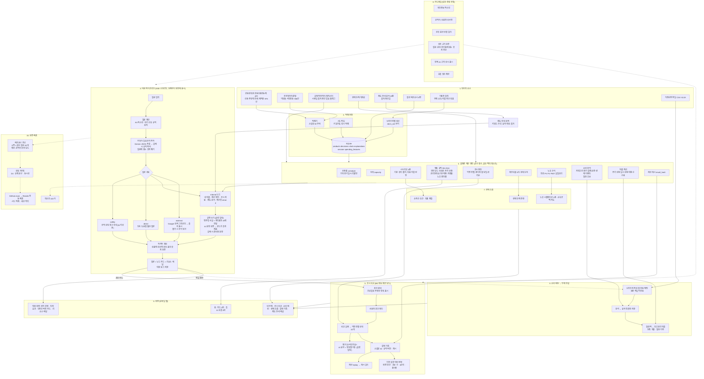

# DONN 전체 파이프라인 (2026-09-06)

소스: `docs/DONN_PIPELINE_FULL.mmd`. 렌더링본: `docs/DONN_PIPELINE_FULL.svg`.

```mermaid
flowchart TB
  %% DONN 전체 파이프라인 (2026-09-06 기준)

  subgraph SRC["1. 데이터 소스"]
    FSS["금융감독원 금융상품한눈에 API<br/>신용·주담대·전세·예적금 978건"]
    DGO["공공데이터포털<br/>디딤돌·서민금융 936건"]
    POL["규제 파라미터 레지스터<br/>시행일·출처·확인 필요 플래그"]
    THR["생애 단계 기준값"]
    KBD["제도 안내 문서 15편<br/>출처·확인일"]
    PER["합성 페르소나 8명"]
    USR["이용자 입력<br/>부채·소득·지출·자산·목표"]
    FILE["거래내역 파일 CSV·XLSX"]
  end

  subgraph STORE["2. 적재·저장"]
    LOAD["적재기<br/>스냅샷 ID 부여"]
    SEED["시드 파일<br/>키 없이도 즉시 적재"]
    DB[("SQLite<br/>products·decisions·chats·explanations<br/>session·spending_features")]
    SID["브라우저별 세션<br/>donn_sid 쿠키"]
  end
  FSS --> LOAD
  DGO --> LOAD
  LOAD --> DB
  SEED --> DB
  PER --> DB
  USR --> SID --> DB
  POL --> CORE
  THR --> CORE
  KBD --> KB

  subgraph CORE["3. 결정론 계산 엔진 (순수 함수, 골든 벡터 테스트)"]
    SCH["상환표 schedule<br/>거치·만기일시·리볼빙"]
    CAP["여력 capacity"]
    SCN["시나리오 3종<br/>기준·유리·불리, 목표 지출 반영"]
    RUL["행동 규칙 R0~R10<br/>안전 모드·비상금·추가 상환·금리인하요구권·대환·저축률·노후 충당률"]
    RANK["공시 랭킹<br/>익명 라벨, 총이자·월 납입·금리순"]
    RAT["재무비율 5개·생애 단계"]
    RET["노후 산식<br/>연금 PV·FV·PMT·실질금리"]
    SPD["소비 분석<br/>카테고리·정기 결제·급증·생애 이벤트<br/>절감 후보"]
    LOAN["대출 계산<br/>추가 상환·일시 상환·대환·수수료"]
    HASH["재현 해시 result_hash"]
  end
  DB --> CORE

  subgraph CHAT["4. 대화 파이프라인 (SSE 스트리밍, 단계마다 화면에 표시)"]
    Q["질문 입력"]
    G1["질문 확인<br/>PII 마스킹 · 위기 신호 규칙 감지"]
    G2["무엇이 필요한지 파악<br/>Gemini JSON 추출 → 실패 시 규칙 파서<br/>질문에 없는 숫자 폐기"]
    ROUTE{"답변 경로"}
    SAFE["safety<br/>공적 상담 창구 안내 (AI 미사용)"]
    DIRECT["direct<br/>인사·도움말 짧은 답변"]
    INT["internal 노드<br/>내 대출 · 계산 엔진 · 공시 자료 · 제도 문서 · 계산형 what-if"]
    EXT["external<br/>Google 검색 그라운딩 → 출처 표시<br/>불가 시 공식 링크"]
    EXPL["설명 쓰기 (슬롯 필링)<br/>범주형 사실 + 자리표만 AI에 전달<br/>AI 문장 검증 → 코드가 숫자 채움<br/>실패 시 준비된 문장"]
    CHK["마지막 점검<br/>상품명·회사명·권유 표현·숫자 검증"]
    REPLY["답변 + 노드 카드 + 리소스 패널<br/>대화 로그 저장"]
  end
  Q --> G1 --> G2 --> ROUTE
  ROUTE --> SAFE --> CHK
  ROUTE --> DIRECT --> CHK
  ROUTE --> INT --> EXPL --> CHK
  ROUTE --> EXT --> CHK
  CHK --> REPLY
  CORE --> INT
  KB["제도 안내 검색<br/>키워드 우선, 요약·핵심·출처"] --> INT

  subgraph CMP["5. 공시 비교 (M0 정보 제공 모드)"]
    PREP["조건 준비<br/>프로필로 추정한 항목 표시"]
    CONF["사용자 조건 확인"]
    RUN["비교 실행 → 익명 라벨 상위 10개"]
    CEXP["왜 이 순서인가요?<br/>AI 요약 + 항목별 이유 (슬롯 필링)"]
    DEC["결정 기록<br/>스냅샷 ID · 규칙 버전 · 해시"]
    REPL["재현 replay → 해시 일치"]
    DELTA["이전 결과 대비 변화<br/>바뀐 조건 · 후보 수 · 1순위 · 총이자"]
  end
  REPLY -->|조건 카드| PREP --> CONF --> RUN --> CEXP
  RANK --> RUN
  RUN --> DEC --> REPL
  DEC --> DELTA
  HASH --> DEC

  subgraph SPEND["6. 소비 패턴 → 부채 연결"]
    PARSE["브라우저 파싱·열 자동 매핑<br/>원본 파일 미전송"]
    ANA["분석 → 요약·특징만 저장"]
    LINK["절감액 → 최고금리 대출<br/>단축 개월 · 절감 이자"]
  end
  FILE --> PARSE --> ANA --> LINK
  SPD --> ANA
  LOAN --> LINK
  REPLY -.->|파일 첨부| PARSE

  subgraph LIFE["7. 생애 흐름"]
    STAGE["생애 단계 판정"]
    GAP["노후 시뮬레이션 3종 · 소득공백 지도"]
    NW["순자산 곡선 · 목표 편집"]
  end
  RAT --> STAGE
  RET --> GAP
  SCN --> NW

  subgraph GUARD["8. 가드레일 (모든 경로 공통)"]
    PII["개인정보 마스킹"]
    BAN["금칙어: 상품명·회사명"]
    FORB["권유 표현·빈말 필터"]
    NUM["숫자 근거 검증<br/>질문·문단·자리표에 없는 숫자 차단"]
    NOTICE["면책·AI 고지 상시 표시"]
    RATE["호출 횟수 제한"]
  end
  GUARD -.-> CHAT
  GUARD -.-> CMP

  subgraph UI["9. 화면 (모바일 웹)"]
    HOME["홈: 카드 3장 · 칩<br/>AI 호출 0회"]
    CV["대화 화면: 생각 과정 · 타자 효과 · 인라인 버튼 카드 · 리소스 패널"]
    SCR["내 부채 · 공시 비교 · 소비 패턴 · 생애 흐름 · 결정 기록 · 제도 안내 패널"]
  end
  REPLY --> CV
  RUL --> HOME
  CMP --> SCR
  SPEND --> SCR
  LIFE --> SCR

  subgraph OPS["10. 검증·배포"]
    TEST["테스트 422개"]
    RUNNER["페르소나 러너<br/>8명 × 골든 질문 82개<br/>재현·금칙어·안전 모드"]
    CRIT["검토 게이트<br/>D4 · 규제 문구 · 동시성"]
    DEPLOY["GitHub main → Render 자동 배포<br/>시드 적재 · 세션 격리"]
  end
  CORE -.-> TEST
  CHAT -.-> RUNNER
  RUNNER -.-> CRIT -.-> DEPLOY
```
