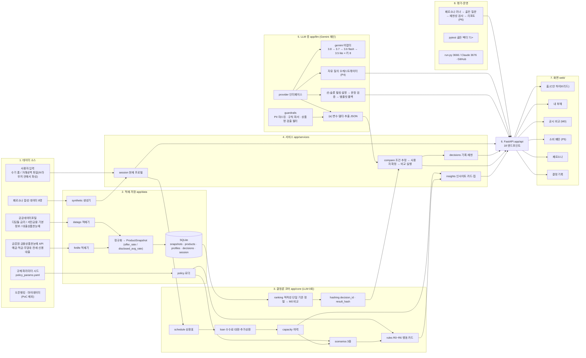

# DONN PoC 전체 파이프라인 (노드 지도)

작성일 2026-09-06. 데모 범위(`DONN_POC_SCOPE.md`) 기준으로 지금 만들고 있는 것과 앞으로 만들 것을 한 장에 그렸다. 상태 표기: 완료 / 진행 중 / 예정(P4~P6) / PoC 제외.

## 노드 상태 (2026-09-06)

| 층 | 노드 | 상태 | 비고 |
|---|---|---|---|
| 1 소스 | 금감원 API 키 | 완료 | 키 검증, 은행 18개사 공시 2026-08 |
| 1 소스 | 공공데이터포털 키 | 완료 | 디딤돌 1건, 서민금융 기본정보 500건, 대출상품한눈에(서금원) 436건 적재. 서금원 API는 게이트웨이 주소에 서비스명이 두 번 들어가야 동작 |
| 1 소스 | 규제 파라미터 시드 | 완료 | 확인 필요 플래그 포함 |
| 1 소스 | 오픈뱅킹 · 마이데이터 | PoC 제외 | MVP 단계로 이월 |
| 2 데이터 | 적재기 · SQLite · 합성 데이터 | 완료 | 상품 1,478건(금감원 977 + 공공데이터 501), 페르소나 8명, 테스트 14개 통과 |
| 3 코어 | 상환표 · 시나리오 · 룰 · 정렬 · 해시 | 완료 | 테스트 71개 통과 |
| 4 서비스 | insights · compare · decisions · session | 완료 | 홈 카드 LLM 0회, 조건 확인 후 비교, 결정 기록 재현 일치 |
| 5 LLM | guardrails · gemini 체인 · 추출 · 설명 | 완료(추출) | 체인 12초 상한, 모델 쿨다운, 발화 근거 없는 숫자 폐기. 설명(f)은 템플릿 우선 |
| 5 LLM | 자유 질의 오케스트레이터 | 예정 (P4) | 도구 호출 |
| 6 API | FastAPI 19 엔드포인트 | 완료 | /api/meta 추가. 테스트 134개 통과 |
| 7 화면 | 홈 · 내 부채 · 공시 비교 · 페르소나 · 결정 기록 | 완료(초안) | Opus 다듬기 예정 |
| 7 화면 | 소비 패턴 | 예정 (P5) | 브라우저 내 파싱·집계 |
| 8 평가 | 페르소나 러너 · 리포트 | 예정 (P6) | |
| 8 운영 | run.py · 포트 분리 · GitHub | 완료 | |

## 요청 한 번의 흐름 (공시 비교)

사용자 발화 → guardrails(PII 마스킹) → Gemini 추출(a) 또는 규칙 파서 → compare.prepare(추정) → 조건 확인 카드(사용자 확정) → ranking(적격성·정렬·계산) → hashing(decision_id, result_hash) → decisions.save → 슬롯 필링 설명(f) → 문장 검증·금지어 필터 → 결과 블록 렌더(익명 라벨 + 공시 링크 + 면책).
