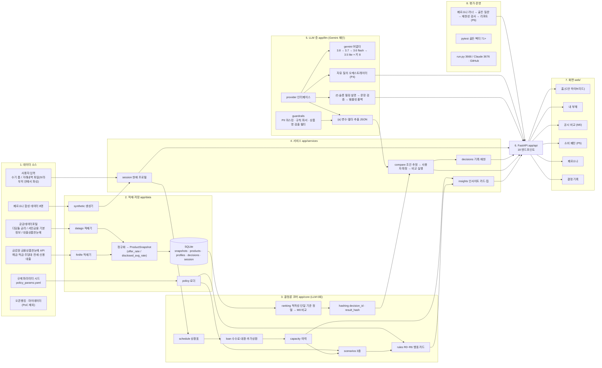

# DONN PoC 전체 파이프라인 (노드 지도)

작성일 2026-09-06. 데모 범위(`DONN_POC_SCOPE.md`) 기준으로 지금 만들고 있는 것과 앞으로 만들 것을 한 장에 그렸다. 상태 표기: 완료 / 진행 중 / 예정(P4~P6) / PoC 제외.

## 노드 상태 (2026-09-06)

| 층 | 노드 | 상태 | 비고 |
|---|---|---|---|
| 1 소스 | 금감원 API 키 | 완료 | 키 검증, 은행 18개사 공시 2026-08 |
| 1 소스 | 공공데이터포털 키 | 완료 | 디딤돌 1건, 서민금융 기본정보 500건, 대출상품한눈에(서금원) 436건 적재. 서금원 API는 게이트웨이 주소에 서비스명이 두 번 들어가야 동작 |
| 1 소스 | 규제 파라미터 시드 | 완료 | 확인 필요 플래그 포함 |
| 1 소스 | 오픈뱅킹 · 마이데이터 | PoC 제외 | MVP 단계로 이월 |
| 2 데이터 | 적재기 · SQLite · 합성 데이터 | 완료 | 상품 1,478건(금감원 977 + 공공데이터 501), 페르소나 8명, 테스트 14개 통과 |
| 3 코어 | 상환표 · 시나리오 · 룰 · 정렬 · 해시 | 완료 | 테스트 71개 통과 |
| 4 서비스 | insights · compare · decisions · session | 완료 | 홈 카드 LLM 0회, 조건 확인 후 비교, 결정 기록 재현 일치 |
| 5 LLM | guardrails · gemini 체인 · 의도·조건 추출 · 제도 KB | 완료 | 체인 12초 상한, 모델 쿨다운, 발화 근거 없는 숫자 폐기. 제도 KB 15편 키워드 검색으로 faq 응답 |
| 5 LLM | 슬롯 필링 설명 (f) | 완료 | LLM은 숫자를 보지도 쓰지도 않는다(코드가 플레이스홀더만 주고받고 값은 코드가 채운다). 검증 실패·LLM 불가 시 템플릿 폴백. 공시 비교 "왜 이 순서인가요?" 설명 실측 8~12초(gemini-3.8-flash/gemini-3.7-flash) |
| 5 LLM | 대화 스트리밍과 생각 과정 (P4b) | 완료 | `POST /api/chat/stream`(SSE)로 발화 점검 → 의도·조건 추출 → 계산 엔진 → 설명 작성 → 응답 점검 단계를 실시간 전송, 화면은 타자 효과로 응답 표시 |
| 5 LLM | 답변 경로(direct/internal/external)와 리소스 패널 (P4b-2) | 완료 | 코드가 경로를 판정해 노드 카드·리소스 패널을 채움. 제도 답변은 "한 줄 요약 + 핵심 3개 + 출처" 형식 |
| 5 LLM | 외부 검색 그라운딩 | 완료 | 내부 자료 부족·시점성 질문일 때 Gemini Google 검색 그라운딩 사용. 금칙어 검출 시 요약 대신 공식 링크만 노출, 그라운딩 자체가 불가하면 공식 기관 링크로 폴백 |
| 5 LLM | 자유 질의 오케스트레이터 | 예정 (P4) | 도구 호출 |
| 6 API | FastAPI 엔드포인트 | 완료 | `/api/chat/stream`(SSE), `/api/compare/{id}/explain`, `/api/actions/{id}/explain` 추가 |
| 7 화면 | 홈 · 내 부채 · 공시 비교 · 계정 선택 · 결정 기록 · 소비 패턴 · 생애 흐름 · 대화 화면 | 완료 | 대화 화면(`#chat`) 추가: 생각 과정 노드 카드, 인라인 액션 카드, 오른쪽 리소스 패널. Opus 다듬기: 로고·Pretendard·계정 선택·대화 로그·제도 안내 패널·소비 패턴·생애 흐름 |
| 7+ 생애주기 층 | 재무비율 · 생애 단계 · 노후 산식 · 목표 시나리오 | 완료 (P7) | 골든 벡터 12개, /api/lifecycle, 연금 KB 3편 |
| 8 평가 | 페르소나 러너 · 리포트 · 데모 스크립트 | 진행 중 (P6) | 골든 질문 82개(direct·external 사례 추가), 재현성·금지어·안전모드 검사, 하드 실패 0건 |
| 8 운영 | run.py · 포트 분리 · GitHub | 완료 | |
| 8 운영 | 배포 (Render) | 완료 | `render.yaml` 블루프린트, main push마다 자동 재배포, 무료 플랜은 15분 무접속 시 절전(첫 접속 30초~1분). GitHub Pages는 README 랜딩만(정적 호스팅이라 앱 실행 불가) |
| 8 운영 | 브라우저 전용 모드 (Pyodide) | 보류 | PMO 결정(2026-09-06). 설계는 SPEC 2.10절에 남기고 구현하지 않음 |
| 8 운영 | 세션 분리(쿠키)·호출 횟수 제한 | 진행 중 | 브라우저별 세션 분리와 Gemini 호출 횟수 제한, Opus 검토 게이트 |

## 요청 한 번의 흐름 (공시 비교)

사용자 발화 → guardrails(PII 마스킹) → Gemini 추출(a) 또는 규칙 파서 → compare.prepare(추정) → 조건 확인 카드(사용자 확정) → ranking(적격성·정렬·계산) → hashing(decision_id, result_hash) → decisions.save → 슬롯 필링 설명(f) → 문장 검증·금지어 필터 → 결과 블록 렌더(익명 라벨 + 공시 링크 + 면책).

## 요청 한 번의 흐름 (대화 스트리밍, SPEC 2.9 / 2.11)

사용자 발화 → **발화 점검**(guard: PII 마스킹, 위기 신호 확인. 위기면 안전 경로로 바로 감) →
**의도·조건 추출**(intent: Gemini 또는 규칙 파서, direct/compare/schedule/scenario/action/
spending/retirement/saving/liquidity/faq 중 하나로 판정) → **노드 실행**(경로별로 하나 이상:
compute/공시 비교 조건 준비, debt_data/내 부채 자료, kb/제도 문서 검색, external/Gemini
Google 검색 그라운딩, direct/직접 답변. 발화에 제도 키워드가 같이 있으면 주 노드와 kb 노드를
함께 실행) → **설명 작성**(explain: 슬롯 필링으로 문장 생성, 화면 안내처럼 숫자 설명이
필요 없는 의도는 건너뜀) → **응답 점검**(check: 상품명·회사명·권유 표현 금칙어 검사, 걸리면
기본 안내 문장으로 대체) → **reply**(`ChatReply` = 텍스트 + `route` + `resources` +
`answer_format` + `trace`). 각 단계는 `POST /api/chat/stream`의 SSE `stage` 이벤트로
실시간 전송되고, 화면은 이를 "생각 과정" 노드 카드로 그리다가 응답이 오면 한 줄
요약("생각 과정 5단계 · 8.9초 · Gemini …")으로 접는다. 스트림이 실패하면 화면은
`POST /api/chat`(생각 과정 없이 한 번에 응답)으로 자동 폴백한다.
